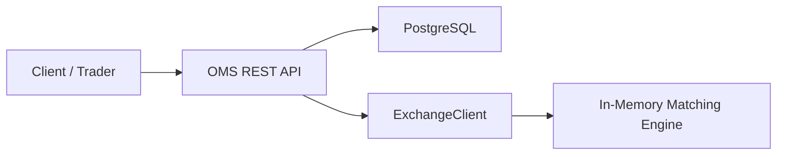
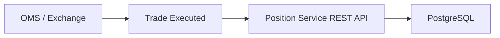
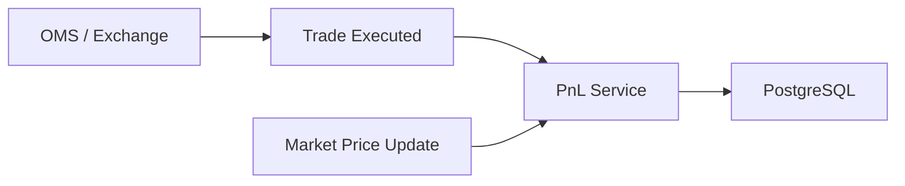
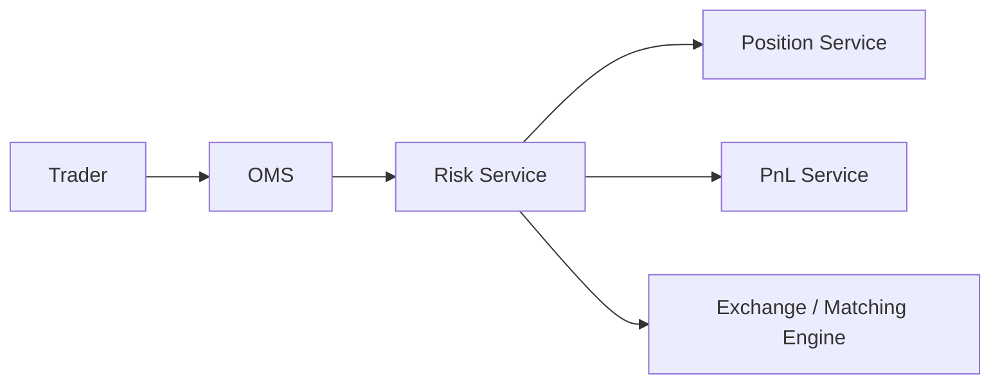
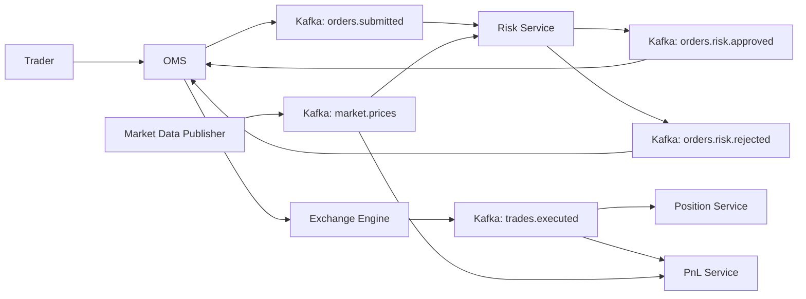
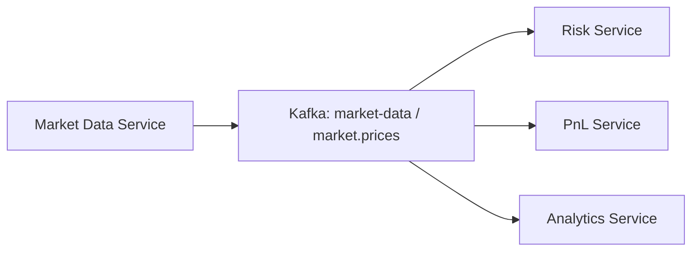
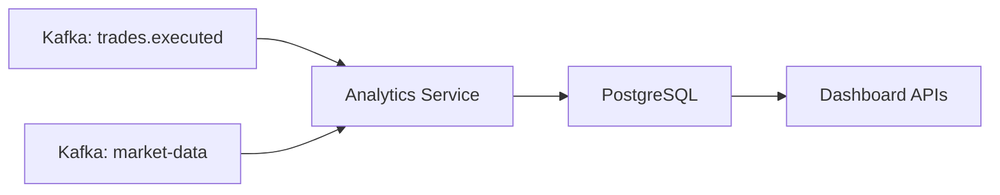
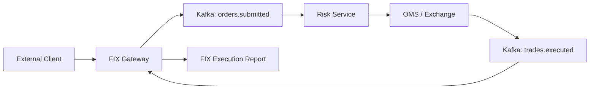
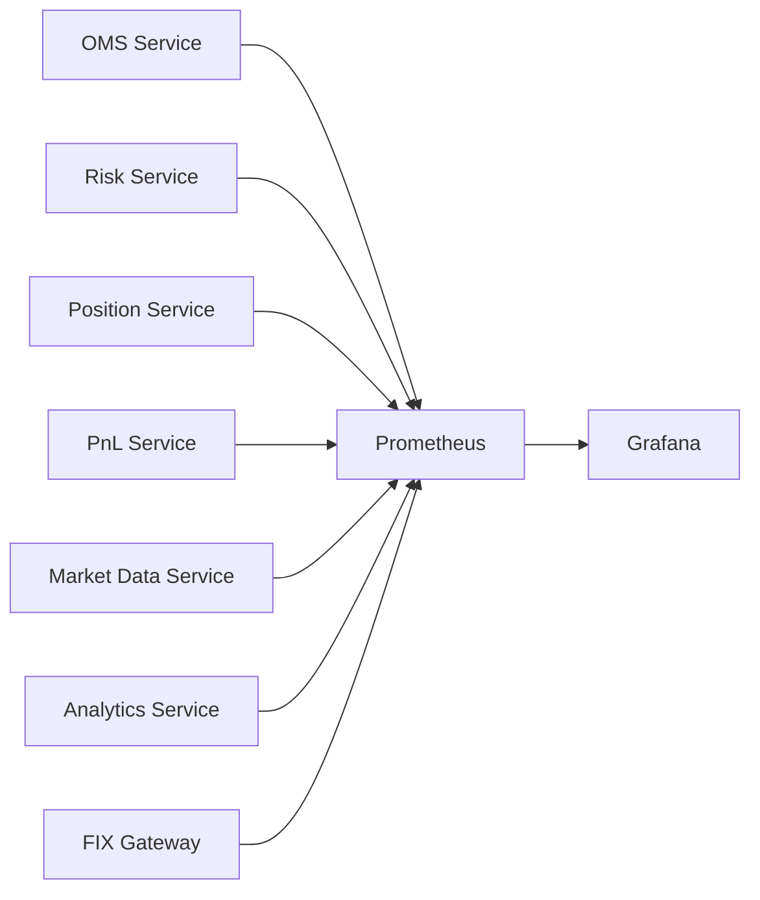
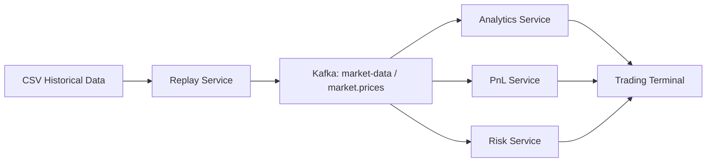

# MarketX

MarketX is a learning-first project for building an institutional electronic trading platform from the ground up.

The goal is to understand how real financial markets technology works before writing production-style backend code. MarketX will grow in phases, starting with market foundations and later moving toward order management, risk checks, exchange connectivity, execution processing, positions, PnL, and settlement workflows.

## Why This Project Exists

Electronic trading systems are used by banks, brokers, hedge funds, exchanges, and trading firms to move orders through complex workflows with very high expectations for speed, reliability, and correctness.

MarketX exists to make those systems easier to understand by building them step by step:

- Learn the business concepts first.
- Document how trades move through market systems.
- Design clear system boundaries before coding.
- Build a resume-quality engineering project with realistic financial technology architecture.

## Phase 0: Market Foundations

Phase 0 is documentation only. It explains the core market concepts and the end-to-end trade lifecycle that future MarketX services will eventually model.

This phase covers:

- What stocks, exchanges, brokers, traders, bids, asks, spreads, and order books are.
- How market and limit orders behave.
- How an order moves through an OMS, risk engine, exchange, matching engine, execution reports, position service, PnL service, and settlement process.
- What can go wrong in a trading workflow.
- Why banks care deeply about latency, reliability, and correctness.

## Phase 1: Exchange Simulator Core Engine

Phase 1 adds a command-line mini exchange simulator written in Java. It focuses only on the in-memory core exchange engine: orders, trades, an order book, price-time priority, and a CLI for placing buy and sell orders.

This phase does not use Spring Boot, Kafka, PostgreSQL, Redis, Docker, React, or microservices.

### How to Run the CLI

Compile the Java files:

```bash
javac -d out $(find src/main/java -name "*.java")
```

Start the exchange simulator:

```bash
java -cp out com.marketx.Main
```

### Supported Commands

| Command | Description |
| --- | --- |
| `PLACE BUY LIMIT AAPL 100 150` | Place a buy limit order for 100 shares at 150. |
| `PLACE SELL LIMIT AAPL 100 150` | Place a sell limit order for 100 shares at 150. |
| `PLACE BUY MARKET AAPL 50` | Place a buy market order for 50 shares. |
| `PLACE SELL MARKET AAPL 50` | Place a sell market order for 50 shares. |
| `BOOK AAPL` | Show top 5 bids, top 5 asks, best bid, best ask, and spread. |
| `DEPTH AAPL` | Same as `BOOK AAPL`. |
| `CANCEL ORD-1` | Cancel an active resting limit order. |
| `MODIFY ORD-1 200 151` | Modify an active limit order. The order loses time priority. |
| `ORDER ORD-1` | Show the current state of one order. |
| `REPORTS ORD-1` | Show execution reports for one order. |
| `TRADES` | Show all executed trades. |
| `HELP` | Show available commands. |
| `EXIT` | Stop the CLI. |

### Example Session

```text
MarketX Exchange Simulator
Type HELP to see available commands.

> PLACE BUY LIMIT AAPL 100 150
ORDER ACCEPTED: BUY LIMIT AAPL 100 @ 150

ORDER BOOK: AAPL

BIDS:
Price      Quantity
150.00     100

ASKS:
Price      Quantity
EMPTY

BEST BID: 150.00
BEST ASK: N/A
SPREAD: N/A

> PLACE SELL LIMIT AAPL 100 150
ORDER ACCEPTED: SELL LIMIT AAPL 100 @ 150
TRADE EXECUTED: AAPL 100 @ 150

ORDER BOOK: AAPL

BIDS:
Price      Quantity
EMPTY

ASKS:
Price      Quantity
EMPTY

BEST BID: N/A
BEST ASK: N/A
SPREAD: N/A

> TRADES
TradeId | Symbol | Qty | Price | BuyOrderId | SellOrderId | Time
1       | AAPL   | 100 | 150   | 1          | 2           | 2026-06-12T10:30:00
```

### Price-Time Priority

The order book chooses which orders trade first using price-time priority.

For buy orders:

- Higher prices have priority.
- If two buy orders have the same price, the earlier order has priority.

For sell orders:

- Lower prices have priority.
- If two sell orders have the same price, the earlier order has priority.

### Market Orders vs Limit Orders

| Order Type | Meaning |
| --- | --- |
| Market Order | Trades immediately against available opposite-side orders. Any unfilled quantity is not stored in the book. |
| Limit Order | Trades only at its limit price or better. Any unfilled quantity remains in the book. |

## Phase 2: Order Book Engine

Phase 2 improves the exchange simulator with a clearer real-time market depth view.

Market depth means the visible buy and sell liquidity available at different price levels. Instead of showing every individual order, the CLI now aggregates all remaining quantity at the same price.

Example:

```text
BIDS:
Price      Quantity
150.00     300
149.00     300

ASKS:
Price      Quantity
151.00     100
152.00     200
```

If two buy orders are waiting at `150.00`, one for `100` shares and one for `200` shares, the book shows one price level:

```text
150.00     300
```

### Top 5 Bids and Asks

The `BOOK AAPL` and `DEPTH AAPL` commands show only the top 5 levels on each side:

- Top 5 bids are the highest buy prices currently waiting.
- Top 5 asks are the lowest sell prices currently waiting.

This is how traders often look at the most important part of the order book without reading every order in the market.

### Best Bid, Best Ask, and Spread

| Term | Meaning |
| --- | --- |
| Best Bid | The highest price buyers are currently willing to pay. |
| Best Ask | The lowest price sellers are currently willing to accept. |
| Spread | `Best Ask - Best Bid`. If either side is empty, the spread is `N/A`. |

### Why TreeMap Replaced PriorityQueue for Depth

Phase 1 used `PriorityQueue`, which is good for finding the single best order to match next. However, it is not ideal for printing a full sorted depth view because it does not expose all levels in clean sorted order without copying and sorting.

Phase 2 uses `TreeMap`:

- Buy levels use reverse order, so the highest price is first.
- Sell levels use natural order, so the lowest price is first.
- Each price level stores a FIFO `Queue<Order>`.
- The queue preserves time priority for orders at the same price.

This gives both correct matching and clean market depth display:

```text
BUY side:
150.00 -> [order1, order2]
149.00 -> [order3]

SELL side:
151.00 -> [order4]
152.00 -> [order5]
```

### Phase 2 Sample Session

```text
> PLACE BUY LIMIT AAPL 100 150
ORDER ACCEPTED: BUY LIMIT AAPL 100 @ 150

ORDER BOOK: AAPL

BIDS:
Price      Quantity
150.00     100

ASKS:
Price      Quantity
EMPTY

BEST BID: 150.00
BEST ASK: N/A
SPREAD: N/A

> PLACE BUY LIMIT AAPL 200 150
ORDER ACCEPTED: BUY LIMIT AAPL 200 @ 150

ORDER BOOK: AAPL

BIDS:
Price      Quantity
150.00     300

ASKS:
Price      Quantity
EMPTY

BEST BID: 150.00
BEST ASK: N/A
SPREAD: N/A

> PLACE SELL LIMIT AAPL 100 151
ORDER ACCEPTED: SELL LIMIT AAPL 100 @ 151

ORDER BOOK: AAPL

BIDS:
Price      Quantity
150.00     300

ASKS:
Price      Quantity
151.00     100

BEST BID: 150.00
BEST ASK: 151.00
SPREAD: 1.00
```

## Phase 3: Matching Engine

Phase 3 upgrades MarketX from a simple simulator into a more complete in-memory matching engine.

It adds:

- Order status tracking.
- Correct price-time priority matching.
- Resting order trade price.
- Partial-fill handling.
- Multiple-match handling.
- Cancel support.
- Modify support.
- Order lookup.
- Execution reports.
- Aggressor side on trades.

### Price Priority

The best price always trades first.

For buy orders, the highest bid has priority:

```text
151.00 before 150.00
```

For sell orders, the lowest ask has priority:

```text
149.00 before 150.00
```

### Time Priority

If two orders are at the same price, the older order trades first.

```text
PLACE BUY LIMIT AAPL 100 150
PLACE BUY LIMIT AAPL 100 150
PLACE SELL LIMIT AAPL 150 149
```

The first buy order fills for `100` before the second buy order receives the remaining `50`.

### Resting Order Price Rule

Trades execute at the resting order price.

If the buy order is resting first:

```text
PLACE BUY LIMIT AAPL 100 150
PLACE SELL LIMIT AAPL 100 149
```

The trade price is `150`.

If the sell order is resting first:

```text
PLACE SELL LIMIT AAPL 100 149
PLACE BUY LIMIT AAPL 100 150
```

The trade price is `149`.

### Partial Fills

Orders track both original quantity and remaining quantity.

```text
PLACE BUY LIMIT AAPL 100 150
PLACE SELL LIMIT AAPL 40 149
```

Result:

- Trade executes for `40`.
- Buy order has `60` remaining.
- Buy order status becomes `PARTIALLY_FILLED`.
- Sell order status becomes `FILLED`.

### Cancel Orders

Only active resting limit orders can be cancelled.

```text
CANCEL ORD-1
```

If the order is still active, it is removed from the order book and marked `CANCELLED`.

### Modify Orders

Only active limit orders can be modified.

```text
MODIFY ORD-1 200 151
```

Every modify loses time priority in this phase. The engine removes the old resting order, creates a refreshed version with the same order ID, assigns a new timestamp, and reinserts it. If the modified price crosses the opposite side, it matches immediately.

### Execution Reports

Execution reports describe lifecycle events for an order:

- New accepted order
- Partial fill
- Full fill
- Cancel
- Modify
- Reject

Use:

```text
REPORTS ORD-1
```

### Matching Engine Design Notes

MarketX keeps the engine intentionally small, but the data structures mirror real exchange concerns.

| Design Choice | Why It Matters |
| --- | --- |
| `TreeMap` price levels | Gives efficient access to the best bid or best ask without scanning the whole book. |
| `Queue<Order>` per price | Preserves time priority for orders at the same price. |
| `orderMap` | Allows fast lookup for cancel, modify, order status, and execution reports. |
| Market orders not stored | Market orders are meant to execute immediately; any unfilled quantity is cancelled instead of resting. |
| Aggregated levels | The book can display market depth without printing every individual order. |

The matching loop only looks at the best opposite price level. This avoids unnecessary scanning and keeps the core logic closer to low-latency exchange design.

### Phase 3 Sample Commands

```text
PLACE BUY LIMIT AAPL 100 150
PLACE BUY LIMIT AAPL 100 150
PLACE SELL LIMIT AAPL 150 149
ORDER ORD-1
ORDER ORD-2
TRADES
REPORTS ORD-1
BOOK AAPL
```

Modify losing priority:

```text
PLACE BUY LIMIT AAPL 100 150
PLACE BUY LIMIT AAPL 100 150
MODIFY ORD-1 100 150
PLACE SELL LIMIT AAPL 100 149
```

`ORD-2` fills before modified `ORD-1` because the modify reset `ORD-1`'s time priority.

## Phase 4: OMS Microservice

Phase 4 adds a Spring Boot Order Management System, or OMS, under `backend/oms-service`.

An OMS is the backend service that accepts trader order requests, validates them, stores them, and routes them toward an exchange. Orders should not directly hit the exchange engine because institutions need a controlled entry point for validation, auditing, persistence, client APIs, and future routing to risk checks or messaging systems.

Phase 4 still does not add Kafka, a risk engine, React, or production microservice orchestration. The OMS uses REST, PostgreSQL, Spring Data JPA, and an `ExchangeClient` interface backed by an in-memory exchange adapter.

### Phase 4 Architecture



### OMS API Endpoints

| Method | Endpoint | Description |
| --- | --- | --- |
| `POST` | `/orders` | Create a new order. |
| `PUT` | `/orders/{orderId}` | Modify an active limit order. |
| `DELETE` | `/orders/{orderId}` | Cancel an active order. |
| `GET` | `/orders/{orderId}` | Get one order. |
| `GET` | `/orders` | List orders with optional `symbol`, `side`, and `status` filters. |
| `GET` | `/order-book/{symbol}` | Get top 5 bids, top 5 asks, best bid, best ask, and spread. |
| `GET` | `/trades` | Get executed trades with optional `symbol` filter. |

### Database Schema

The OMS uses PostgreSQL through Spring Data JPA.

`orders`

| Field | Meaning |
| --- | --- |
| `id` | Database primary key. |
| `orderId` | External order ID such as `ORD-1`. |
| `accountId` | Account that owns the order, such as `TRADER-1`. |
| `symbol` | Instrument symbol, such as `AAPL`. |
| `side` | `BUY` or `SELL`. |
| `type` | `MARKET` or `LIMIT`. |
| `originalQuantity` | Quantity requested when the order was created or modified. |
| `remainingQuantity` | Quantity still open. |
| `price` | Limit price, or `0` for market orders. |
| `status` | `NEW`, `PARTIALLY_FILLED`, `FILLED`, `CANCELLED`, or `REJECTED`. |
| `createdAt` | Creation timestamp. |
| `updatedAt` | Last update timestamp. |

`trades`

| Field | Meaning |
| --- | --- |
| `tradeId` | External trade ID such as `TRD-1`. |
| `symbol` | Instrument symbol. |
| `quantity` | Executed quantity. |
| `price` | Execution price. |
| `buyOrderId` | Buy order ID. |
| `sellOrderId` | Sell order ID. |
| `buyAccountId` | Account that owns the buy order. |
| `sellAccountId` | Account that owns the sell order. |
| `aggressorSide` | Incoming order side that caused the match. |
| `executedAt` | Execution timestamp. |

`execution_reports`

| Field | Meaning |
| --- | --- |
| `executionId` | Execution report ID such as `EXE-1`. |
| `orderId` | Related order ID. |
| `symbol` | Instrument symbol. |
| `side` | Order side. |
| `status` | Order status at report time. |
| `executedQuantity` | Quantity executed for the report event. |
| `executedPrice` | Execution price if applicable. |
| `remainingQuantity` | Remaining quantity after the event. |
| `message` | Human-readable event message. |
| `createdAt` | Report timestamp. |

### How to Run PostgreSQL

From the OMS service directory:

```bash
cd backend/oms-service
docker compose up -d postgres
```

The local database config is:

```text
database: marketx_oms
username: marketx
password: marketx
port: 5432
```

### How to Run the OMS

From `backend/oms-service`:

```bash
mvn spring-boot:run
```

The service runs on:

```text
http://localhost:8080
```

### Sample Curl Commands

Create a limit order:

```bash
curl -X POST http://localhost:8080/orders \
  -H "Content-Type: application/json" \
  -d '{
    "accountId": "TRADER-1",
    "symbol": "AAPL",
    "side": "BUY",
    "type": "LIMIT",
    "quantity": 100,
    "price": 150.0
  }'
```

Create a market order:

```bash
curl -X POST http://localhost:8080/orders \
  -H "Content-Type: application/json" \
  -d '{
    "accountId": "TRADER-1",
    "symbol": "AAPL",
    "side": "BUY",
    "type": "MARKET",
    "quantity": 50
  }'
```

Modify an order:

```bash
curl -X PUT http://localhost:8080/orders/ORD-1 \
  -H "Content-Type: application/json" \
  -d '{
    "quantity": 200,
    "price": 151.0
  }'
```

Cancel an order:

```bash
curl -X DELETE http://localhost:8080/orders/ORD-1
```

Get one order:

```bash
curl http://localhost:8080/orders/ORD-1
```

List orders:

```bash
curl http://localhost:8080/orders
curl "http://localhost:8080/orders?symbol=AAPL"
curl "http://localhost:8080/orders?status=FILLED"
curl "http://localhost:8080/orders?side=BUY"
```

Get the order book:

```bash
curl http://localhost:8080/order-book/AAPL
```

Get trades:

```bash
curl http://localhost:8080/trades
curl "http://localhost:8080/trades?symbol=AAPL"
```

### Phase 4 Test Flow

1. Start PostgreSQL.
2. Start the OMS service.
3. `POST` a `BUY LIMIT AAPL 100 @ 150`.
4. `POST` a `SELL LIMIT AAPL 100 @ 150`.
5. Confirm a trade appears with `GET /trades`.
6. Check market depth with `GET /order-book/AAPL`.
7. Check persisted orders with `GET /orders`.
8. Modify an active order with `PUT /orders/{orderId}`.
9. Cancel an active order with `DELETE /orders/{orderId}`.

## Phase 5: Position Service

Phase 5 adds a separate Spring Boot Position Service under `backend/position-service`.

The Position Service tracks net holdings by `accountId + symbol` after trades execute.

```text
BUY 100 AAPL  -> +100 AAPL
SELL 40 AAPL -> +60 AAPL
SELL 100 AAPL -> -40 AAPL
```

A positive position is `LONG`, a negative position is `SHORT`, and zero is `FLAT`.

### Phase 5 Architecture



In Phase 8, Position Service consumes `TradeExecutedEvent` messages from Kafka. The REST endpoint remains available for manual testing.

### Position Service APIs

| Method | Endpoint | Description |
| --- | --- | --- |
| `POST` | `/positions/events/trade` | Process an executed trade event. |
| `GET` | `/positions/{accountId}/{symbol}` | Get a position for one account and symbol. |
| `GET` | `/positions/{accountId}` | Get all positions for one account. |
| `GET` | `/positions` | Get all positions. |

### Position Database

The Position Service uses a separate PostgreSQL database:

```text
marketx_positions
```

Main tables:

| Table | Purpose |
| --- | --- |
| `positions` | Stores net quantity, average price, and position type by account and symbol. |
| `processed_trades` | Stores processed trade IDs to prevent duplicate position updates. |

### Position Service Run Commands

Start PostgreSQL:

```bash
cd backend/oms-service
docker compose up -d postgres
```

Run the Position Service:

```bash
cd backend/position-service
mvn spring-boot:run
```

The Position Service runs on:

```text
http://localhost:8081
```

### Position Curl Examples

Process a BUY trade event:

```bash
curl -X POST http://localhost:8081/positions/events/trade \
  -H "Content-Type: application/json" \
  -d '{
    "tradeId": "TRD-1-BUY",
    "accountId": "TRADER-1",
    "symbol": "AAPL",
    "side": "BUY",
    "quantity": 100,
    "price": 150.0,
    "executedAt": "2026-06-09T10:00:00"
  }'
```

Expected position:

```json
{
  "accountId": "TRADER-1",
  "symbol": "AAPL",
  "netQuantity": 100,
  "averagePrice": 150.0,
  "positionType": "LONG"
}
```

Process a SELL trade event:

```bash
curl -X POST http://localhost:8081/positions/events/trade \
  -H "Content-Type: application/json" \
  -d '{
    "tradeId": "TRD-2-SELL",
    "accountId": "TRADER-1",
    "symbol": "AAPL",
    "side": "SELL",
    "quantity": 40,
    "price": 155.0,
    "executedAt": "2026-06-09T10:05:00"
  }'
```

Expected position:

```json
{
  "netQuantity": 60,
  "positionType": "LONG"
}
```

Flip long to short:

```bash
curl -X POST http://localhost:8081/positions/events/trade \
  -H "Content-Type: application/json" \
  -d '{
    "tradeId": "TRD-3-SELL",
    "accountId": "TRADER-1",
    "symbol": "AAPL",
    "side": "SELL",
    "quantity": 100,
    "price": 160.0,
    "executedAt": "2026-06-09T10:10:00"
  }'
```

Expected position:

```json
{
  "netQuantity": -40,
  "positionType": "SHORT"
}
```

Get a position:

```bash
curl http://localhost:8081/positions/TRADER-1/AAPL
```

### OMS Integration

Phase 5 adds `accountId` to OMS order requests and responses.

When OMS stores a newly executed trade, it sends two trade events to Position Service:

- Buyer account receives a `BUY` event.
- Seller account receives a `SELL` event.

The event IDs are suffixed, for example `TRD-1-BUY` and `TRD-1-SELL`, so duplicate protection works per account-side event.

## Phase 6: PnL Engine

Phase 6 adds a separate Spring Boot PnL Service under `backend/pnl-service`.

The PnL Service tracks profit and loss by `accountId + symbol`.

It calculates:

- Realized PnL from closed or reduced positions.
- Unrealized PnL from open positions using the latest market price.
- Total PnL as `realizedPnl + unrealizedPnl`.

### Phase 6 Architecture



In Phase 8, PnL Service consumes `TradeExecutedEvent` and `MarketPriceEvent` messages from Kafka. REST endpoints remain available for manual testing.

### PnL Formulas

Long unrealized PnL:

```text
(currentPrice - averagePrice) * netQuantity
```

Short unrealized PnL:

```text
(averagePrice - currentPrice) * abs(netQuantity)
```

Long realized PnL:

```text
(sellPrice - averagePrice) * closedQuantity
```

Short realized PnL:

```text
(averagePrice - buyPrice) * closedQuantity
```

Total PnL:

```text
realizedPnl + unrealizedPnl
```

### PnL APIs

| Method | Endpoint | Description |
| --- | --- | --- |
| `POST` | `/pnl/events/trade` | Process a trade event. |
| `POST` | `/pnl/events/market-price` | Update latest market price and recalculate unrealized PnL. |
| `GET` | `/pnl/{accountId}/{symbol}` | Get one account-symbol PnL row. |
| `GET` | `/pnl/{accountId}` | Get all PnL rows for one account. |
| `GET` | `/pnl` | Get all PnL rows. |

### PnL Service Run Commands

Start PostgreSQL:

```bash
cd backend/oms-service
docker compose up -d postgres
```

Run the PnL Service:

```bash
cd backend/pnl-service
mvn spring-boot:run
```

The PnL Service runs on:

```text
http://localhost:8082
```

### PnL Curl Examples

Process a BUY trade:

```bash
curl -X POST http://localhost:8082/pnl/events/trade \
  -H "Content-Type: application/json" \
  -d '{
    "tradeId": "TRD-1",
    "accountId": "TRADER-1",
    "symbol": "AAPL",
    "side": "BUY",
    "quantity": 100,
    "price": 100.0,
    "executedAt": "2026-06-09T10:00:00"
  }'
```

Update market price:

```bash
curl -X POST http://localhost:8082/pnl/events/market-price \
  -H "Content-Type: application/json" \
  -d '{
    "symbol": "AAPL",
    "price": 105.0,
    "timestamp": "2026-06-09T10:01:00"
  }'
```

Expected:

```json
{
  "realizedPnl": 0,
  "unrealizedPnl": 500,
  "totalPnl": 500
}
```

Realize part of the position:

```bash
curl -X POST http://localhost:8082/pnl/events/trade \
  -H "Content-Type: application/json" \
  -d '{
    "tradeId": "TRD-2",
    "accountId": "TRADER-1",
    "symbol": "AAPL",
    "side": "SELL",
    "quantity": 40,
    "price": 110.0,
    "executedAt": "2026-06-09T10:05:00"
  }'
```

Expected if market price is still `105`:

```json
{
  "netQuantity": 60,
  "averagePrice": 100,
  "realizedPnl": 400,
  "unrealizedPnl": 300,
  "totalPnl": 700
}
```

Get PnL:

```bash
curl http://localhost:8082/pnl/TRADER-1/AAPL
```

### OMS Integration

In Phase 8, OMS publishes newly executed trades to Kafka topic `trades.executed`.

Position Service and PnL Service both consume the same `TradeExecutedEvent`.

For each trade:

- Buyer account receives a `BUY` event.
- Seller account receives a `SELL` event.

PnL event IDs use the same side suffix pattern as positions, such as `TRD-1-BUY` and `TRD-1-SELL`, so duplicate-trade protection works per account-side event.

## Phase 7 - Risk Engine

Phase 7 adds a pre-trade Risk Service.

The OMS no longer sends every valid order directly to the exchange. It now asks the Risk Service to approve the order first.



### What The Risk Engine Does

| Check | What it prevents |
| --- | --- |
| Max order quantity | Accidentally sending an order that is too large. |
| Max position quantity | Building a position bigger than the account is allowed to hold. |
| Exposure limit | Taking too much notional market exposure in one order. |
| Max daily loss | Continuing to trade after account PnL has breached the loss limit. |

Exposure is calculated as:

```text
quantity * price
```

For `LIMIT` orders, the order price is used. For `MARKET` orders, Risk Service uses its latest stored market price. If that market price is missing, the order is rejected because the exposure cannot be measured.

### Risk APIs

| Method | Endpoint | Description |
| --- | --- | --- |
| `POST` | `/risk/evaluate` | Evaluate an order before exchange routing. |
| `PUT` | `/risk/limits/{accountId}` | Create or update account risk limits. |
| `GET` | `/risk/limits/{accountId}` | Get account risk limits. |
| `GET` | `/risk/decisions/{accountId}` | Get risk decision history. |
| `POST` | `/risk/market-price` | Store latest price for market-order exposure checks. |

### Risk Service Run Commands

Start PostgreSQL:

```bash
cd backend/oms-service
docker compose up -d postgres
```

Run the Risk Service:

```bash
cd backend/risk-service
mvn spring-boot:run
```

The Risk Service runs on:

```text
http://localhost:8083
```

### Risk Curl Examples

Set risk limits:

```bash
curl -X PUT http://localhost:8083/risk/limits/TRADER-1 \
  -H "Content-Type: application/json" \
  -d '{
    "maxOrderQuantity": 10000,
    "maxPositionQuantity": 50000,
    "maxExposure": 1000000,
    "maxDailyLoss": 50000
  }'
```

Update market price:

```bash
curl -X POST http://localhost:8083/risk/market-price \
  -H "Content-Type: application/json" \
  -d '{
    "symbol": "AAPL",
    "price": 150.0,
    "timestamp": "2026-06-09T10:00:00"
  }'
```

Evaluate a safe order:

```bash
curl -X POST http://localhost:8083/risk/evaluate \
  -H "Content-Type: application/json" \
  -d '{
    "accountId": "TRADER-1",
    "symbol": "AAPL",
    "side": "BUY",
    "type": "LIMIT",
    "quantity": 100,
    "price": 150.0
  }'
```

Evaluate a dangerous order:

```bash
curl -X POST http://localhost:8083/risk/evaluate \
  -H "Content-Type: application/json" \
  -d '{
    "accountId": "TRADER-1",
    "symbol": "AAPL",
    "side": "BUY",
    "type": "LIMIT",
    "quantity": 1000000,
    "price": 150.0
  }'
```

Expected rejection reasons:

```json
[
  "Order quantity exceeds max allowed quantity",
  "Exposure limit exceeded"
]
```

### OMS Risk Integration

Phase 7 adds an OMS `RiskClient`.

The new OMS order flow is:

```text
POST /orders
  -> OMS validation
  -> Risk Service evaluation
  -> REJECTED order saved if risk fails
  -> Exchange routing only if risk approves
```

If Risk Service is unavailable, OMS rejects the order safely and does not send it to the exchange.

## Phase 8 - Kafka Event Bus

Phase 8 adds Kafka as the event bus for MarketX.

The platform now supports an asynchronous order flow:



REST APIs remain available for manual testing, but new orders no longer synchronously call Risk Service from `POST /orders`.

The new order behavior is:

```text
POST /orders
  -> OMS saves order as PENDING_RISK
  -> OMS publishes OrderSubmittedEvent
  -> Risk Service consumes and evaluates
  -> Risk publishes approved or rejected event
  -> OMS consumes the risk result
  -> Approved orders route to the embedded exchange
  -> Executed trades publish TradeExecutedEvent
```

### Kafka Topics

| Topic | Produced By | Consumed By |
| --- | --- | --- |
| `orders.submitted` | OMS | Risk Service |
| `orders.risk.approved` | Risk Service | OMS |
| `orders.risk.rejected` | Risk Service | OMS |
| `trades.executed` | OMS embedded exchange adapter | OMS, Position Service, PnL Service |
| `market.prices` | PnL market price publisher | Risk Service, PnL Service |

### Shared Event Contracts

Shared event records live in:

```text
backend/common-events
```

Events include:

- `OrderSubmittedEvent`
- `OrderRiskApprovedEvent`
- `OrderRiskRejectedEvent`
- `TradeExecutedEvent`
- `MarketPriceEvent`

### Start Kafka

From the repository root:

```bash
docker compose up -d
```

This starts PostgreSQL and Kafka, then creates:

```text
orders.submitted
orders.risk.approved
orders.risk.rejected
trades.executed
market.prices
```

Install shared event contracts before running services:

```bash
cd backend/common-events
mvn install
```

Full Phase 8 notes are in [Phase 8 Kafka Event Bus](docs/phase-8-kafka-event-bus.md).

## Phase 9: Market Data Feed

Phase 9 adds a Spring Boot Market Data Service under `backend/market-data-service`.

The service generates simulated live prices once per second for:

- `AAPL`, starting at `150.00`
- `MSFT`, starting at `420.00`
- `GOOG`, starting at `180.00`

Each tick moves the price slightly up or down, calculates volume, bid, ask, spread, absolute change, and percent change, then publishes the update to Kafka.

### Market Data Topics

| Topic | Purpose |
| --- | --- |
| `market-data` | New enriched Phase 9 market data feed. |
| `market.prices` | Backward-compatible Phase 8 price topic used by existing Risk and PnL consumers. |

### Why Market Data Matters

Trading platforms need live prices to make decisions:

- Risk uses latest prices for market order exposure checks.
- PnL uses latest prices to recalculate unrealized PnL.
- Analytics can later consume the same feed for dashboards, alerts, and trend calculations.

### Phase 9 Architecture



### Market Data Event

The `market-data` topic carries enriched events:

```json
{
  "eventId": "EVT-1",
  "symbol": "AAPL",
  "price": 150.25,
  "previousPrice": 150.00,
  "change": 0.25,
  "changePercent": 0.1667,
  "volume": 1200,
  "bidPrice": 150.20,
  "askPrice": 150.30,
  "spread": 0.10,
  "timestamp": "2026-06-09T10:00:00"
}
```

### Market Data APIs

| Method | Endpoint | Description |
| --- | --- | --- |
| `GET` | `/market-data/latest` | Latest prices for all symbols. |
| `GET` | `/market-data/latest/{symbol}` | Latest price for one symbol. |
| `POST` | `/market-data/start` | Start scheduled publishing. |
| `POST` | `/market-data/stop` | Stop scheduled publishing. |
| `POST` | `/market-data/tick` | Manually publish one tick for all symbols. |
| `POST` | `/market-data/symbols` | Add a new symbol with a starting price. |

### Run Market Data Service

```bash
cd backend/market-data-service
mvn spring-boot:run
```

Sample commands:

```bash
curl http://localhost:8084/market-data/latest
curl http://localhost:8084/market-data/latest/AAPL
curl -X POST http://localhost:8084/market-data/stop
curl -X POST http://localhost:8084/market-data/start
curl -X POST http://localhost:8084/market-data/tick
curl -X POST http://localhost:8084/market-data/symbols \
  -H "Content-Type: application/json" \
  -d '{
    "symbol": "TSLA",
    "startingPrice": 250.0
  }'
```

## Phase 10: Analytics Service

Phase 10 adds a Spring Boot Analytics Service under `backend/analytics-service`.

The service consumes live market data and executed trades from Kafka, stores symbol-level metrics in PostgreSQL, and exposes dashboard-ready REST APIs.

### Analytics Metrics

| Metric | Meaning |
| --- | --- |
| VWAP | Total traded value divided by total traded volume. |
| Volume | Total executed trade quantity for the symbol. |
| Spread | Latest ask price minus latest bid price from market data. |
| Trade Count | Number of executed trades processed for the symbol. |

VWAP example:

```text
Trade 1: 100 @ 150 = 15000
Trade 2: 200 @ 153 = 30600

totalVolume = 300
totalTradedValue = 45600
VWAP = 152.00
```

### Analytics Architecture



### Kafka Topics Consumed

| Topic | Purpose |
| --- | --- |
| `market-data` | Updates latest price, bid, ask, and spread. |
| `market.prices` | Compatibility price updates for latest price only. |
| `trades.executed` | Updates VWAP, executed volume, total traded value, and trade count. |

### Analytics APIs

| Method | Endpoint | Description |
| --- | --- | --- |
| `GET` | `/analytics/{symbol}` | Analytics for one symbol. |
| `GET` | `/analytics` | Analytics for all symbols. |
| `GET` | `/analytics/dashboard` | Compact dashboard-ready summary. |
| `DELETE` | `/analytics/{symbol}/reset` | Reset one symbol. |
| `DELETE` | `/analytics/reset` | Reset all analytics rows. |
| `POST` | `/analytics/events/trade` | Manually process a trade event. |
| `POST` | `/analytics/events/market-data` | Manually process a market data event. |

### Run Analytics Service

```bash
cd backend/analytics-service
mvn spring-boot:run
```

Sample commands:

```bash
curl http://localhost:8085/analytics/AAPL
curl http://localhost:8085/analytics/dashboard
curl -X POST http://localhost:8085/analytics/events/market-data \
  -H "Content-Type: application/json" \
  -d '{
    "eventId": "MD-1",
    "symbol": "AAPL",
    "price": 150.50,
    "previousPrice": 150.00,
    "change": 0.50,
    "changePercent": 0.33,
    "volume": 1000,
    "bidPrice": 150.45,
    "askPrice": 150.55,
    "spread": 0.10,
    "timestamp": "2026-06-09T10:00:00"
  }'
curl -X POST http://localhost:8085/analytics/events/trade \
  -H "Content-Type: application/json" \
  -d '{
    "eventId": "TRD-EVT-1",
    "tradeId": "TRD-1",
    "symbol": "AAPL",
    "quantity": 100,
    "price": 150.00,
    "buyOrderId": "ORD-1",
    "sellOrderId": "ORD-2",
    "buyAccountId": "TRADER-1",
    "sellAccountId": "TRADER-2",
    "aggressorSide": "BUY",
    "executedAt": "2026-06-09T10:01:00"
  }'
```

## Phase 11: FIX Gateway

Phase 11 adds a simplified educational FIX Gateway under `backend/fix-gateway-service`.

The gateway accepts pipe-delimited FIX-style messages over REST, validates them, converts supported messages into internal MarketX Kafka events, stores inbound and outbound FIX messages for audit, and generates simplified FIX `35=8` Execution Reports from internal outcomes.

This phase does not use QuickFIX/J and does not implement a full production FIX session engine.

### FIX Gateway Architecture



### Supported FIX Messages

| MsgType | Meaning |
| --- | --- |
| `35=D` | New Order Single |
| `35=F` | Order Cancel Request |
| `35=8` | Execution Report generated by MarketX |

Important tags:

| Tag | Meaning |
| --- | --- |
| `11` | Client order id, or `ClOrdID`. |
| `41` | Original client order id for cancels. |
| `55` | Symbol. |
| `54` | Side: `1` = BUY, `2` = SELL. |
| `38` | Quantity. |
| `40` | Order type: `1` = MARKET, `2` = LIMIT. |
| `44` | Limit price. |
| `60` | Transaction time. |

### FIX Kafka Topics

Produced:

| Topic | Purpose |
| --- | --- |
| `fix.inbound` | Raw inbound FIX audit stream. |
| `orders.submitted` | New orders converted from `35=D`. |
| `orders.cancel.requested` | Cancel requests converted from `35=F`. |
| `fix.execution.reports` | Outbound raw FIX `35=8` reports. |

Consumed:

| Topic | Purpose |
| --- | --- |
| `trades.executed` | Generates fill execution reports. |
| `orders.risk.rejected` | Generates rejected execution reports. |
| `orders.cancelled` | Generates cancelled execution reports. |

### FIX Gateway APIs

| Method | Endpoint | Description |
| --- | --- | --- |
| `POST` | `/fix/messages` | Submit a simplified FIX message. |
| `GET` | `/fix/reports` | Return generated FIX execution reports. |
| `GET` | `/fix/reports/{clOrdId}` | Return reports for one client order id. |

### Run FIX Gateway

```bash
cd backend/fix-gateway-service
mvn spring-boot:run
```

Sample commands:

```bash
curl -X POST http://localhost:8086/fix/messages \
  -H "Content-Type: application/json" \
  -d '{
    "message": "8=FIX.4.4|35=D|49=CLIENT1|56=MARKETX|11=CLORD-1|55=AAPL|54=1|38=100|40=2|44=150.00|60=20260609-10:00:00|"
  }'
curl -X POST http://localhost:8086/fix/messages \
  -H "Content-Type: application/json" \
  -d '{
    "message": "8=FIX.4.4|35=D|49=CLIENT2|56=MARKETX|11=CLORD-2|55=AAPL|54=2|38=100|40=2|44=150.00|60=20260609-10:00:05|"
  }'
curl http://localhost:8086/fix/reports
curl http://localhost:8086/fix/reports/CLORD-1
```

Example generated `35=8` fill report:

```text
8=FIX.4.4|35=8|49=MARKETX|56=CLIENT1|11=CLORD-1|17=EXEC-TRD-1-BUY-1|150=2|39=2|55=AAPL|54=1|38=100|14=100|151=0|31=150.00|32=100|60=20260609-10:01:00|
```

## Phase 12: React Trading Terminal

Phase 12 adds a Bloomberg-style frontend under `frontend/trading-terminal`.

The terminal is a Vite + React JavaScript app using Tailwind CSS, Axios, and Recharts. It gives a compact dark trading UI for interacting with the MarketX backend services.

### Trading Terminal Screens

| Screen | Purpose |
| --- | --- |
| Dashboard | Market overview, PnL, volume, and trade count. |
| Order Entry | Submit BUY/SELL, LIMIT/MARKET orders to OMS. |
| Order Book | View bids, asks, best bid, best ask, and spread. |
| Positions | View account positions by symbol. |
| PnL | View realized, unrealized, and total PnL. |
| Market Data | View latest prices and control simulated feed updates. |
| Analytics | View VWAP, spread, volume, and trade count charts. |
| FIX Gateway | Submit simplified FIX messages and view execution reports. |

### Frontend API Connections

| Service | Port |
| --- | --- |
| OMS Service | `8080` |
| Position Service | `8081` |
| PnL Service | `8082` |
| Risk Service | `8083` |
| Market Data Service | `8084` |
| Analytics Service | `8085` |
| FIX Gateway Service | `8086` |

Run the terminal:

```bash
cd frontend/trading-terminal
npm install
npm run dev
```

Open:

```text
http://localhost:5173
```

## Phase 13: Monitoring

Phase 13 adds production-style monitoring for MarketX using Spring Boot Actuator, Micrometer, Prometheus, and Grafana.

Each backend service exposes operational and custom trading metrics at:

```text
/actuator/prometheus
```

Each backend service also exposes health at:

```text
/actuator/health
```

### Monitoring Architecture



### Metrics Exposed

| Area | Metrics |
| --- | --- |
| OMS | `orders_submitted_total`, `orders_rejected_total`, `orders_filled_total`, `order_processing_latency_ms_seconds_*` |
| Risk | `risk_checks_total`, `risk_approved_total`, `risk_rejected_total`, `risk_check_latency_ms_seconds_*` |
| Market Data | `market_data_ticks_published_total`, `market_data_publish_latency_ms_seconds_*`, `market_data_publishing_enabled` |
| FIX Gateway | `fix_messages_received_total`, `fix_messages_rejected_total`, `fix_execution_reports_sent_total` |
| Analytics | `analytics_events_consumed_total`, `analytics_update_latency_ms_seconds_*` |
| Position | `position_updates_total`, `position_update_latency_ms_seconds_*` |
| PnL | `pnl_updates_total`, `pnl_calculation_latency_ms_seconds_*` |
| Platform | `http_server_requests_seconds_*`, `process_cpu_usage`, `jvm_memory_used_bytes`, datasource health metrics |

Prometheus scrapes every service from `monitoring/prometheus/prometheus.yml`. Grafana is provisioned with a default Prometheus datasource and the `MarketX Trading System Monitoring` dashboard.

Start monitoring:

```bash
docker compose -f docker-compose.monitoring.yml up -d
```

Open:

```text
Prometheus: http://localhost:9090
Grafana:    http://localhost:3000
Login:      admin / admin
```

Testing flow:

1. Start PostgreSQL, Kafka, and all backend services.
2. Start the monitoring stack.
3. Open Prometheus and search for `orders_submitted_total`, `risk_checks_total`, and `market_data_ticks_published_total`.
4. Open Grafana and view `MarketX Trading System Monitoring`.
5. Submit orders and confirm the graphs move.

## Phase 14: Historical Replay Engine

Phase 14 adds a backtesting-style Replay Service under `backend/replay-service`.

The Replay Service loads historical market ticks from CSV, creates replay sessions, and publishes replayed market data into Kafka. This lets MarketX replay old market sessions into the existing analytics, PnL, risk, and trading terminal flows.

### Replay Architecture



### Replay APIs

| Method | Endpoint | Description |
| --- | --- | --- |
| `POST` | `/replay/sessions` | Create replay session from CSV file path or multipart upload. |
| `POST` | `/replay/sessions/{sessionId}/play` | Start or resume background replay. |
| `POST` | `/replay/sessions/{sessionId}/pause` | Pause replay and preserve current index. |
| `POST` | `/replay/sessions/{sessionId}/stop` | Stop replay and reset current index. |
| `POST` | `/replay/sessions/{sessionId}/speed` | Change speed to `1x`, `2x`, `5x`, `10x`, or another positive multiplier. |
| `GET` | `/replay/sessions/{sessionId}` | Return replay status. |
| `GET` | `/replay/sessions` | Return all replay sessions. |

### Replay Metrics

| Metric | Meaning |
| --- | --- |
| `replay_sessions_started_total` | Replay sessions started or resumed. |
| `replay_ticks_published_total` | Historical ticks published to Kafka. |
| `replay_active_sessions` | Active replay worker count. |
| `replay_publish_latency_ms_seconds_*` | Replay tick publish timer series. |

### Run Replay Service

```bash
cd backend/replay-service
mvn spring-boot:run
```

Sample session:

```bash
curl -X POST http://localhost:8087/replay/sessions \
  -H "Content-Type: application/json" \
  -d '{
    "filePath": "data/replay/sample-aapl-session.csv",
    "speedMultiplier": 1
  }'

curl -X POST http://localhost:8087/replay/sessions/REPLAY-1/play
curl -X POST http://localhost:8087/replay/sessions/REPLAY-1/pause
curl -X POST http://localhost:8087/replay/sessions/REPLAY-1/speed \
  -H "Content-Type: application/json" \
  -d '{"speedMultiplier": 5}'
curl -X POST http://localhost:8087/replay/sessions/REPLAY-1/stop
curl http://localhost:8087/replay/sessions/REPLAY-1
```

The React Trading Terminal now includes a `Historical Replay` page for creating sessions, playing, pausing, stopping, changing speed, and watching progress.

## Phase 15: Production Deployment

Phase 15 Dockerizes the full MarketX system as a production-style distributed trading platform.

The deployment includes:

- Multi-stage Dockerfiles for all Spring Boot services.
- A Vite React Trading Terminal image served by Nginx.
- Root `docker-compose.yml` with OMS, Risk, Position, PnL, Market Data, Analytics, FIX Gateway, Replay, Kafka, Redis, PostgreSQL, Nginx, Prometheus, and Grafana.
- Nginx API gateway routes under `/api`.
- PostgreSQL database initialization for each service database.
- Environment-variable based Docker configuration without hardcoded localhost service dependencies.
- Docker `json-file` log rotation and Spring console log patterns with service names.
- Prometheus scrape targets using Docker service names and Grafana dashboard provisioning.
- GitHub Actions CI for Maven services, the React terminal, and Docker image builds.
- Optional Docker Hub publish workflow gated by Docker Hub secrets.

Run the full platform:

```bash
docker compose build
docker compose up -d
```

Open:

```text
Trading Terminal: http://localhost
Grafana:          http://localhost:3000
Prometheus:       http://localhost:9090
OMS API:          http://localhost/api/orders
```

See [Deployment Guide](docs/deployment.md) for ports, environment variables, logs, gateway routes, and the end-to-end Docker test.

## Documentation

- [How a Trade Happens](docs/phase-0/how-a-trade-happens.md)
- [Glossary](docs/phase-0/glossary.md)
- [Trade Flow Diagram](docs/phase-0/diagrams/trade-flow.md)
- [Order Book Example](docs/phase-0/diagrams/order-book-example.md)
- [Phase 8 Kafka Event Bus](docs/phase-8-kafka-event-bus.md)
- [Trading Terminal README](frontend/trading-terminal/README.md)
- [Monitoring README](monitoring/README.md)
- [Replay Service README](backend/replay-service/README.md)
- [Deployment Guide](docs/deployment.md)

## Future Phases

Future phases may include:

| Phase | Focus |
| --- | --- |
| Phase 1 | Exchange simulator core engine |
| Phase 2 | Order book engine and market depth |
| Phase 3 | Matching engine, order state, cancel, modify, and execution reports |
| Phase 4 | OMS microservice with REST, PostgreSQL, and JPA |
| Phase 5 | Position Service with net long, short, and flat holdings |
| Phase 6 | PnL Engine with realized, unrealized, and total PnL |
| Phase 7 | Risk Engine with pre-trade checks and OMS risk gating |
| Phase 8 | Kafka Event Bus with asynchronous order, risk, trade, and market price events |
| Phase 9 | Market Data Feed with simulated live prices over Kafka |
| Phase 10 | Analytics Service with VWAP, volume, spread, and trade count APIs |
| Phase 11 | Simplified FIX Gateway for new orders, cancels, and execution reports |
| Phase 12 | React Trading Terminal with order entry, market data, analytics, PnL, and FIX screens |
| Phase 13 | Prometheus and Grafana monitoring for trading metrics, latency, errors, CPU, and memory |
| Phase 14 | Historical Replay Engine for CSV-based market-session replay into Kafka |
| Phase 15 | Production Docker Compose deployment with gateway, observability, logging, and CI/CD |

MarketX currently contains Phase 0 documentation, the Phase 1 in-memory exchange simulator, the Phase 2 market depth order book engine, the Phase 3 matching engine, the Phase 4 OMS microservice, the Phase 5 Position Service, the Phase 6 PnL Engine, the Phase 7 Risk Engine, the Phase 8 Kafka Event Bus, the Phase 9 Market Data Feed, the Phase 10 Analytics Service, the Phase 11 FIX Gateway, the Phase 12 React Trading Terminal, the Phase 13 Monitoring stack, the Phase 14 Historical Replay Engine, and the Phase 15 Production Deployment layer.
