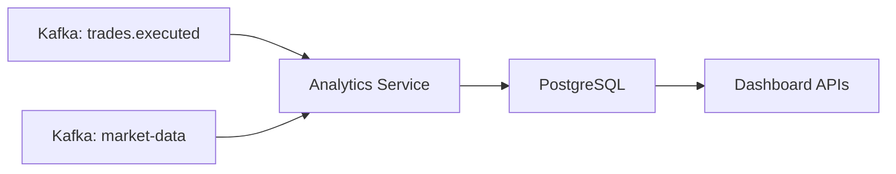

# MarketX Analytics Service

The Analytics Service is the Phase 10 dashboard-ready metrics service for MarketX. It consumes live market data and executed trade events from Kafka, stores rolling symbol metrics in PostgreSQL, and exposes REST APIs that a future dashboard can call.

This phase does not build React, Grafana, or FIX Gateway.

## What It Calculates

| Metric | Meaning |
| --- | --- |
| VWAP | Volume Weighted Average Price: total traded value divided by total traded volume. |
| Volume | Executed trade quantity for the symbol. Market-data feed volume is not counted in this metric. |
| Spread | Latest ask price minus latest bid price from market data. |
| Trade Count | Number of executed trades processed for the symbol. |

## VWAP

VWAP shows the average execution price weighted by quantity.

```text
VWAP = total traded value / total traded volume
total traded value = sum(trade price * trade quantity)
total traded volume = sum(trade quantity)
```

Example:

```text
Trade 1: 100 @ 150 = 15000
Trade 2: 200 @ 153 = 30600

totalVolume = 300
totalTradedValue = 45600
VWAP = 45600 / 300 = 152.00
```

## Kafka Topics Consumed

| Topic | Event | Use |
| --- | --- | --- |
| `market-data` | `MarketDataEvent` | Updates latest price, bid, ask, and spread. |
| `market.prices` | `MarketPriceEvent` | Compatibility price feed; updates latest price only. |
| `trades.executed` | `TradeExecutedEvent` | Updates VWAP, executed volume, traded value, and trade count. |

The consumer group is `analytics-service-group`.

## Architecture



## Database

The service uses PostgreSQL database:

```text
marketx_analytics
```

Tables are created by Spring Data JPA with `ddl-auto: update`.

If your Postgres container already exists from earlier phases, create the database manually:

```sql
CREATE DATABASE marketx_analytics;
```

## REST APIs

| Method | Endpoint | Description |
| --- | --- | --- |
| `GET` | `/analytics/{symbol}` | Get analytics for one symbol. |
| `GET` | `/analytics` | Get analytics for all symbols. |
| `GET` | `/analytics/dashboard` | Get compact dashboard-ready rows. |
| `DELETE` | `/analytics/{symbol}/reset` | Reset one symbol. |
| `DELETE` | `/analytics/reset` | Reset all analytics rows. |
| `POST` | `/analytics/events/trade` | Manually process a trade event. |
| `POST` | `/analytics/events/market-data` | Manually process a market data event. |

## Example Responses

Single symbol:

```json
{
  "symbol": "AAPL",
  "vwap": 150.42,
  "volume": 12000,
  "spread": 0.10,
  "tradeCount": 45,
  "latestPrice": 150.50,
  "bidPrice": 150.45,
  "askPrice": 150.55,
  "lastUpdatedAt": "2026-06-09T10:00:00"
}
```

Dashboard:

```json
{
  "symbols": [
    {
      "symbol": "AAPL",
      "vwap": 150.42,
      "volume": 12000,
      "spread": 0.10,
      "tradeCount": 45
    }
  ]
}
```

## Running Locally

Start PostgreSQL and Kafka:

```bash
docker compose up -d
```

Run Analytics Service:

```bash
cd backend/analytics-service
mvn spring-boot:run
```

The service runs on port `8085`.

## Sample Curl Commands

Get analytics:

```bash
curl http://localhost:8085/analytics/AAPL
```

Get dashboard:

```bash
curl http://localhost:8085/analytics/dashboard
```

Manual market data event:

```bash
curl -X POST http://localhost:8085/analytics/events/market-data \
  -H "Content-Type: application/json" \
  -d '{
    "eventId": "MD-1",
    "symbol": "AAPL",
    "price": 150.50,
    "previousPrice": 150.00,
    "change": 0.50,
    "changePercent": 0.33,
    "volume": 1000,
    "bidPrice": 150.45,
    "askPrice": 150.55,
    "spread": 0.10,
    "timestamp": "2026-06-09T10:00:00"
  }'
```

Manual trade event:

```bash
curl -X POST http://localhost:8085/analytics/events/trade \
  -H "Content-Type: application/json" \
  -d '{
    "eventId": "TRD-EVT-1",
    "tradeId": "TRD-1",
    "symbol": "AAPL",
    "quantity": 100,
    "price": 150.00,
    "buyOrderId": "ORD-1",
    "sellOrderId": "ORD-2",
    "buyAccountId": "TRADER-1",
    "sellAccountId": "TRADER-2",
    "aggressorSide": "BUY",
    "executedAt": "2026-06-09T10:01:00"
  }'
```

Expected after one trade:

```text
VWAP = 150.00
Volume = 100
Trade Count = 1
```

## Dashboard Use Later

A future React or Grafana dashboard can call `/analytics/dashboard` to display one row per symbol with VWAP, volume, spread, and trade count. The richer `/analytics/{symbol}` endpoint is available for detail views.
