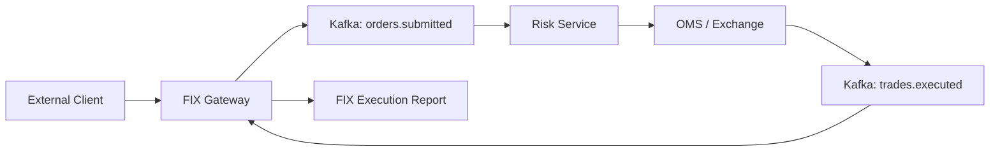

# MarketX FIX Gateway Service

The FIX Gateway Service is the Phase 11 educational FIX-style messaging gateway for MarketX. It accepts simplified FIX messages over REST, validates them, converts them into internal Kafka events, and converts internal execution outcomes back into simplified FIX `35=8` Execution Reports.

This is not a full production FIX engine. It intentionally uses a small parser and pipe-delimited messages so the workflow is easy to understand before introducing QuickFIX/J or real session management.

## What FIX Is

FIX, or Financial Information eXchange, is a messaging protocol used by banks, brokers, exchanges, hedge funds, and trading platforms to send orders, cancels, executions, and other trading messages between systems.

MarketX supports a readable educational format using `|` instead of the real FIX SOH delimiter.

## Supported Message Types

| MsgType | Meaning | Direction |
| --- | --- | --- |
| `35=D` | New Order Single | Client to MarketX |
| `35=F` | Order Cancel Request | Client to MarketX |
| `35=8` | Execution Report | MarketX to client |

## Supported Tags

| Tag | Name | Meaning |
| --- | --- | --- |
| `8` | BeginString | FIX version, such as `FIX.4.4`. |
| `35` | MsgType | `D`, `F`, or `8`. |
| `49` | SenderCompID | Sender, such as `CLIENT1`. |
| `56` | TargetCompID | Target, such as `MARKETX`. |
| `11` | ClOrdID | Client order id. |
| `41` | OrigClOrdID | Original order id for cancels. |
| `55` | Symbol | Instrument symbol. |
| `54` | Side | `1` = BUY, `2` = SELL. |
| `38` | OrderQty | Order quantity. |
| `40` | OrdType | `1` = MARKET, `2` = LIMIT. |
| `44` | Price | Required for LIMIT orders. |
| `60` | TransactTime | Timestamp in `yyyyMMdd-HH:mm:ss`. |
| `17` | ExecID | Execution id on reports. |
| `150` | ExecType | `2` = FILL, `4` = CANCELLED, `8` = REJECTED. |
| `39` | OrdStatus | `2` = FILLED, `4` = CANCELLED, `8` = REJECTED. |
| `14` | CumQty | Cumulative filled quantity. |
| `151` | LeavesQty | Remaining quantity. |
| `31` | LastPx | Last execution price. |
| `32` | LastQty | Last execution quantity. |

## Architecture



## Kafka Topics

Produced:

| Topic | Purpose |
| --- | --- |
| `fix.inbound` | Raw inbound FIX audit stream. |
| `orders.submitted` | New orders converted from `35=D`. |
| `orders.cancel.requested` | Cancel requests converted from `35=F`. |
| `fix.execution.reports` | Outbound raw FIX `35=8` reports. |

Consumed:

| Topic | Purpose |
| --- | --- |
| `trades.executed` | Generates fill execution reports. |
| `orders.risk.rejected` | Generates rejected execution reports. |
| `orders.cancelled` | Generates cancelled execution reports. |

## REST APIs

| Method | Endpoint | Description |
| --- | --- | --- |
| `POST` | `/fix/messages` | Submit a simplified FIX message. |
| `GET` | `/fix/reports` | Return all generated FIX execution reports. |
| `GET` | `/fix/reports/{clOrdId}` | Return reports for one client order id. |

## Run Locally

Start PostgreSQL and Kafka:

```bash
docker compose up -d
```

Run the gateway:

```bash
cd backend/fix-gateway-service
mvn spring-boot:run
```

The service runs on port `8086` and uses PostgreSQL database `marketx_fix`.

If your Postgres container already exists from earlier phases, create the database manually:

```sql
CREATE DATABASE marketx_fix;
```

## Sample Messages

New BUY LIMIT:

```text
8=FIX.4.4|35=D|49=CLIENT1|56=MARKETX|11=CLORD-1|55=AAPL|54=1|38=100|40=2|44=150.00|60=20260609-10:00:00|
```

New SELL LIMIT:

```text
8=FIX.4.4|35=D|49=CLIENT2|56=MARKETX|11=CLORD-2|55=AAPL|54=2|38=100|40=2|44=150.00|60=20260609-10:00:05|
```

Cancel:

```text
8=FIX.4.4|35=F|49=CLIENT1|56=MARKETX|11=CANCEL-1|41=CLORD-1|55=AAPL|54=1|60=20260609-10:05:00|
```

Example generated execution report:

```text
8=FIX.4.4|35=8|49=MARKETX|56=CLIENT1|11=CLORD-1|17=EXEC-TRD-1-BUY-1|150=2|39=2|55=AAPL|54=1|38=100|14=100|151=0|31=150.00|32=100|60=20260609-10:01:00|
```

## Sample Curl Commands

Submit FIX New Order:

```bash
curl -X POST http://localhost:8086/fix/messages \
  -H "Content-Type: application/json" \
  -d '{
    "message": "8=FIX.4.4|35=D|49=CLIENT1|56=MARKETX|11=CLORD-1|55=AAPL|54=1|38=100|40=2|44=150.00|60=20260609-10:00:00|"
  }'
```

Submit matching sell:

```bash
curl -X POST http://localhost:8086/fix/messages \
  -H "Content-Type: application/json" \
  -d '{
    "message": "8=FIX.4.4|35=D|49=CLIENT2|56=MARKETX|11=CLORD-2|55=AAPL|54=2|38=100|40=2|44=150.00|60=20260609-10:00:05|"
  }'
```

Get FIX reports:

```bash
curl http://localhost:8086/fix/reports
```

Get reports for order:

```bash
curl http://localhost:8086/fix/reports/CLORD-1
```

## OMS Integration

The OMS now consumes `orders.submitted` from external producers such as the FIX Gateway, materializes those orders as `PENDING_RISK`, and later processes Risk approval or rejection as before.

The OMS also consumes `orders.cancel.requested`, cancels the original order through its existing cancellation flow, and publishes `orders.cancelled`. The FIX Gateway consumes `orders.cancelled` and returns a `35=8` cancelled report.
