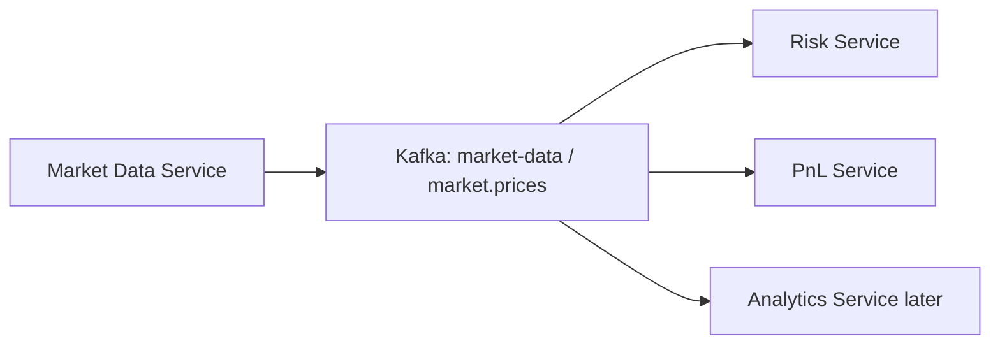

# MarketX Market Data Service

The Market Data Service is the Phase 9 live price feed for MarketX. It generates simulated price ticks for instruments such as `AAPL`, `MSFT`, and `GOOG`, then publishes those updates to Kafka once per second.

Trading systems need live prices because risk, PnL, analytics, order routing, and trader screens all depend on a current view of the market. A market order cannot be checked for exposure without a reference price, and unrealized PnL cannot be recalculated without fresh marks.

## What It Publishes

The service publishes to two Kafka topics:

| Topic | Payload | Purpose |
| --- | --- | --- |
| `market-data` | `MarketDataEvent` | Full Phase 9 enriched market data event. |
| `market.prices` | `MarketPriceEvent` | Backward-compatible Phase 8 price event for existing Risk and PnL consumers. |

Publishing both topics allows new consumers to use the richer market data schema while keeping existing services stable.

## Event Schema

`market-data` events contain:

```json
{
  "eventId": "EVT-1",
  "symbol": "AAPL",
  "price": 150.25,
  "previousPrice": 150.00,
  "change": 0.25,
  "changePercent": 0.1667,
  "volume": 1200,
  "bidPrice": 150.20,
  "askPrice": 150.30,
  "spread": 0.10,
  "timestamp": "2026-06-09T10:00:00"
}
```

## Bid, Ask, and Spread

| Term | Meaning |
| --- | --- |
| Bid | The price buyers are willing to pay. |
| Ask | The price sellers are willing to accept. |
| Spread | The difference between ask and bid. Tight spreads usually mean more liquid markets. |

This simulator sets:

```text
bidPrice = price - 0.05
askPrice = price + 0.05
spread = askPrice - bidPrice
```

## Price Generation

Initial symbols:

| Symbol | Starting Price |
| --- | ---: |
| `AAPL` | `150.00` |
| `MSFT` | `420.00` |
| `GOOG` | `180.00` |

Every tick:

- Each symbol moves randomly between `-0.5%` and `+0.5%`.
- Prices are kept positive and rounded to 2 decimals.
- Random volume is generated.
- Bid and ask prices are calculated around the latest price.
- Price calculations use `BigDecimal`.

## Architecture



Kafka is used because market data is naturally event-driven. Many services may need the same price tick at the same time, and Kafka lets the feed publish once while each consumer processes independently.

## API Endpoints

| Method | Endpoint | Description |
| --- | --- | --- |
| `GET` | `/market-data/latest` | Return latest prices for all symbols. |
| `GET` | `/market-data/latest/{symbol}` | Return latest price for one symbol. |
| `POST` | `/market-data/start` | Enable scheduled publishing. |
| `POST` | `/market-data/stop` | Disable scheduled publishing. |
| `POST` | `/market-data/tick` | Manually publish one tick for all symbols. |
| `POST` | `/market-data/symbols` | Add a new symbol to the in-memory feed. |

## Running Locally

Start Kafka first, then run the service:

```bash
cd backend/market-data-service
mvn spring-boot:run
```

The service runs on port `8084`.

If this is your first time running a backend service that depends on shared events, install the local event contracts first:

```bash
cd backend/common-events
mvn install
```

## Sample Curl Commands

Get latest prices:

```bash
curl http://localhost:8084/market-data/latest
```

Get one symbol:

```bash
curl http://localhost:8084/market-data/latest/AAPL
```

Stop the feed:

```bash
curl -X POST http://localhost:8084/market-data/stop
```

Start the feed:

```bash
curl -X POST http://localhost:8084/market-data/start
```

Manual tick:

```bash
curl -X POST http://localhost:8084/market-data/tick
```

Add symbol:

```bash
curl -X POST http://localhost:8084/market-data/symbols \
  -H "Content-Type: application/json" \
  -d '{
    "symbol": "TSLA",
    "startingPrice": 250.0
  }'
```

## Risk and PnL Integration

Risk Service already consumes `market.prices`. The Market Data Service continues publishing that topic so Risk can store latest prices and use them for market order exposure checks.

PnL Service already consumes `market.prices`. The Market Data Service continues publishing that topic so PnL can update latest marks and recalculate unrealized PnL.

Future services can consume the richer `market-data` topic when they need bid, ask, spread, volume, and change fields.

## Logs

Each tick is logged clearly:

```text
Published market data: AAPL price=150.25 bid=150.20 ask=150.30 volume=1200
```

## Testing Flow

Run:

1. Kafka
2. Risk Service
3. PnL Service
4. Market Data Service

Expected:

- Market Data Service publishes ticks every second.
- Risk Service updates latest prices from `market.prices`.
- PnL Service recalculates unrealized PnL from `market.prices`.
- Logs show events being produced and consumed.
