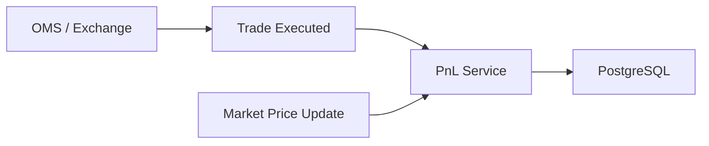

# MarketX PnL Service

The PnL Service tracks profit and loss by `accountId + symbol`.

It calculates:

- Realized PnL from trades that reduce or close a position.
- Unrealized PnL from open positions using the latest market price.
- Total PnL as realized plus unrealized PnL.

## PnL Concepts

| Term | Meaning |
| --- | --- |
| Realized PnL | Profit or loss locked in by reducing or closing a position. |
| Unrealized PnL | Profit or loss on an open position using current market price. |
| Total PnL | `realizedPnl + unrealizedPnl`. |

## Formulas

Long unrealized PnL:

```text
(currentPrice - averagePrice) * netQuantity
```

Short unrealized PnL:

```text
(averagePrice - currentPrice) * abs(netQuantity)
```

Long realized PnL:

```text
(sellPrice - averagePrice) * closedQuantity
```

Short realized PnL:

```text
(averagePrice - buyPrice) * closedQuantity
```

## Position Flips

Long to short:

```text
LONG 100 @ 100
SELL 150 @ 110
Realized PnL = (110 - 100) * 100 = 1000
New position = SHORT 50 @ 110
```

Short to long:

```text
SHORT 100 @ 100
BUY 150 @ 90
Realized PnL = (100 - 90) * 100 = 1000
New position = LONG 50 @ 90
```

## Duplicate Trade Protection

The service stores processed trade IDs. Reprocessing the same trade returns `409 Conflict`, which prevents double-counting realized PnL and position changes.

## Architecture



For Phase 6, OMS notifies PnL Service by REST. Later, trade events and market data can move to Kafka.

## Run

Start PostgreSQL:

```bash
cd ../oms-service
docker compose up -d postgres
```

Run the PnL Service:

```bash
cd ../pnl-service
mvn spring-boot:run
```

The service runs on:

```text
http://localhost:8082
```

## APIs

| Method | Endpoint | Description |
| --- | --- | --- |
| `POST` | `/pnl/events/trade` | Process a trade event. |
| `POST` | `/pnl/events/market-price` | Update latest market price and recalculate unrealized PnL. |
| `GET` | `/pnl/{accountId}/{symbol}` | Get one PnL row. |
| `GET` | `/pnl/{accountId}` | Get all PnL rows for an account. |
| `GET` | `/pnl` | Get all PnL rows. |

## Curl Examples

Buy 100 AAPL at 100:

```bash
curl -X POST http://localhost:8082/pnl/events/trade \
  -H "Content-Type: application/json" \
  -d '{
    "tradeId": "TRD-1",
    "accountId": "TRADER-1",
    "symbol": "AAPL",
    "side": "BUY",
    "quantity": 100,
    "price": 100.0,
    "executedAt": "2026-06-09T10:00:00"
  }'
```

Update market price:

```bash
curl -X POST http://localhost:8082/pnl/events/market-price \
  -H "Content-Type: application/json" \
  -d '{
    "symbol": "AAPL",
    "price": 105.0,
    "timestamp": "2026-06-09T10:01:00"
  }'
```

Sell 40 AAPL at 110:

```bash
curl -X POST http://localhost:8082/pnl/events/trade \
  -H "Content-Type: application/json" \
  -d '{
    "tradeId": "TRD-2",
    "accountId": "TRADER-1",
    "symbol": "AAPL",
    "side": "SELL",
    "quantity": 40,
    "price": 110.0,
    "executedAt": "2026-06-09T10:05:00"
  }'
```

Get PnL:

```bash
curl http://localhost:8082/pnl/TRADER-1/AAPL
```
