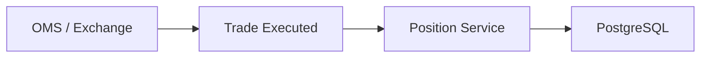

# MarketX Position Service

The Position Service tracks trader holdings after trades execute.

It stores net positions by `accountId + symbol`.

```text
BUY 100 AAPL  -> netQuantity = 100
SELL 40 AAPL -> netQuantity = 60
SELL 100 AAPL -> netQuantity = -40
```

Negative quantity means the account is short.

## Why Positions Matter

Banks and trading firms need accurate positions because every later workflow depends on them:

- Traders need to know what they own or owe.
- Risk teams need exposure by account and symbol.
- PnL systems need positions to calculate profit and loss.
- Settlement workflows need final holdings.

## Position Types

| Type | Meaning |
| --- | --- |
| `LONG` | Net quantity is greater than zero. |
| `SHORT` | Net quantity is less than zero. |
| `FLAT` | Net quantity is zero. |

## Duplicate Trade Protection

The service stores every processed `tradeId` in `processed_trades`.

If the same trade arrives twice, the service returns `409 Conflict`. This is important because processing the same trade twice would create incorrect positions.

## Architecture



For Phase 5, OMS notifies the Position Service by REST. In a later phase, this can be replaced with Kafka trade events.

## Run

Start PostgreSQL from the OMS service directory:

```bash
cd ../oms-service
docker compose up -d postgres
```

Run the Position Service:

```bash
cd ../position-service
mvn spring-boot:run
```

The service runs on:

```text
http://localhost:8081
```

## APIs

| Method | Endpoint | Description |
| --- | --- | --- |
| `POST` | `/positions/events/trade` | Process an executed trade event. |
| `GET` | `/positions/{accountId}/{symbol}` | Get one position. |
| `GET` | `/positions/{accountId}` | Get all positions for an account. |
| `GET` | `/positions` | Get all positions. |

## Curl Examples

Create a long position:

```bash
curl -X POST http://localhost:8081/positions/events/trade \
  -H "Content-Type: application/json" \
  -d '{
    "tradeId": "TRD-1-BUY",
    "accountId": "TRADER-1",
    "symbol": "AAPL",
    "side": "BUY",
    "quantity": 100,
    "price": 150.0,
    "executedAt": "2026-06-09T10:00:00"
  }'
```

Reduce the long position:

```bash
curl -X POST http://localhost:8081/positions/events/trade \
  -H "Content-Type: application/json" \
  -d '{
    "tradeId": "TRD-2-SELL",
    "accountId": "TRADER-1",
    "symbol": "AAPL",
    "side": "SELL",
    "quantity": 40,
    "price": 155.0,
    "executedAt": "2026-06-09T10:05:00"
  }'
```

Flip from long to short:

```bash
curl -X POST http://localhost:8081/positions/events/trade \
  -H "Content-Type: application/json" \
  -d '{
    "tradeId": "TRD-3-SELL",
    "accountId": "TRADER-1",
    "symbol": "AAPL",
    "side": "SELL",
    "quantity": 100,
    "price": 160.0,
    "executedAt": "2026-06-09T10:10:00"
  }'
```

Get one position:

```bash
curl http://localhost:8081/positions/TRADER-1/AAPL
```

Get all positions:

```bash
curl http://localhost:8081/positions
```
