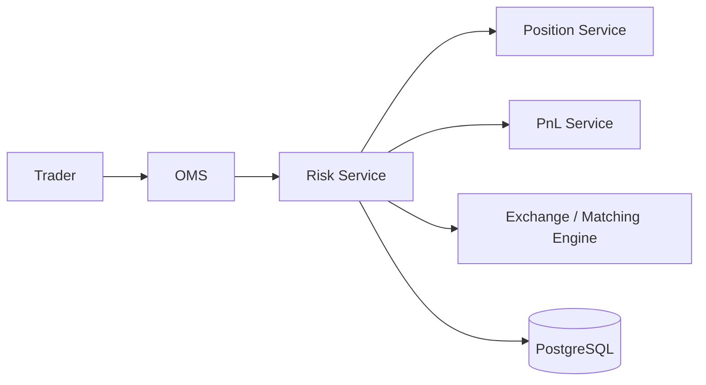

# MarketX Risk Service

Phase 7 adds a pre-trade Risk Engine to MarketX.

The Risk Service decides whether an order is safe before the OMS sends it to the exchange. In a real trading platform, this is one of the most important controls because a bad order can create oversized positions, large exposure, or losses that exceed the account limit.

## Architecture



## What The Risk Engine Checks

| Check | Meaning | Rejection Example |
| --- | --- | --- |
| Max order quantity | One order cannot be larger than the account limit. | `BUY 1000000 AAPL` when max quantity is `10000`. |
| Max position quantity | The projected position after the order must stay inside the account limit. | Current `9500`, buy `1000`, max position `10000`. |
| Exposure limit | `quantity * price` must be below the account exposure limit. | `10000 * 200 = 2000000`, limit is `1000000`. |
| Max daily loss | If account PnL is already below the loss limit, new orders are blocked. | PnL is `-60000`, max daily loss is `50000`. |

Market orders use the latest price stored in Risk Service for exposure. If that price is missing, the order is rejected because the risk cannot be measured safely.

## Default Limits

If an account has no configured limits, the service creates conservative defaults:

| Limit | Default |
| --- | ---: |
| Max order quantity | `10000` |
| Max position quantity | `50000` |
| Max exposure | `1000000` |
| Max daily loss | `50000` |

`maxDailyLoss` is stored as a positive number. If current total PnL is less than or equal to `-maxDailyLoss`, orders are rejected.

## APIs

| Method | Endpoint | Description |
| --- | --- | --- |
| `POST` | `/risk/evaluate` | Evaluate an order before it reaches the exchange. |
| `PUT` | `/risk/limits/{accountId}` | Create or update account risk limits. |
| `GET` | `/risk/limits/{accountId}` | Get configured account limits. |
| `GET` | `/risk/decisions/{accountId}` | Get risk decision history. |
| `POST` | `/risk/market-price` | Store latest price for market-order exposure checks. |

## Run

Start PostgreSQL:

```bash
cd backend/oms-service
docker compose up -d postgres
```

Run the Position Service on `8081`, the PnL Service on `8082`, and then run Risk Service:

```bash
cd backend/risk-service
mvn spring-boot:run
```

Risk Service runs on:

```text
http://localhost:8083
```

## Curl Examples

Set account limits:

```bash
curl -X PUT http://localhost:8083/risk/limits/TRADER-1 \
  -H "Content-Type: application/json" \
  -d '{
    "maxOrderQuantity": 10000,
    "maxPositionQuantity": 50000,
    "maxExposure": 1000000,
    "maxDailyLoss": 50000
  }'
```

Store a market price:

```bash
curl -X POST http://localhost:8083/risk/market-price \
  -H "Content-Type: application/json" \
  -d '{
    "symbol": "AAPL",
    "price": 150.0,
    "timestamp": "2026-06-09T10:00:00"
  }'
```

Evaluate a safe order:

```bash
curl -X POST http://localhost:8083/risk/evaluate \
  -H "Content-Type: application/json" \
  -d '{
    "accountId": "TRADER-1",
    "symbol": "AAPL",
    "side": "BUY",
    "type": "LIMIT",
    "quantity": 100,
    "price": 150.0
  }'
```

Example approved response:

```json
{
  "approved": true,
  "decision": "APPROVED",
  "reasons": [],
  "accountId": "TRADER-1",
  "symbol": "AAPL"
}
```

Evaluate a dangerous order:

```bash
curl -X POST http://localhost:8083/risk/evaluate \
  -H "Content-Type: application/json" \
  -d '{
    "accountId": "TRADER-1",
    "symbol": "AAPL",
    "side": "BUY",
    "type": "LIMIT",
    "quantity": 1000000,
    "price": 150.0
  }'
```

Example rejected response:

```json
{
  "approved": false,
  "decision": "REJECTED",
  "reasons": [
    "Order quantity exceeds max allowed quantity",
    "Exposure limit exceeded"
  ],
  "accountId": "TRADER-1",
  "symbol": "AAPL"
}
```

## OMS Integration

Phase 7 adds an OMS `RiskClient`.

The OMS flow is now:

```text
POST /orders
  -> OMS validates the request
  -> OMS calls Risk Service
  -> If rejected, OMS stores the order as REJECTED
  -> If approved, OMS sends the order to the exchange
```

If Risk Service is unavailable, OMS rejects the order safely instead of sending it to the exchange.

## Future Kafka Migration

This phase uses REST so the services stay easy to run locally. In a later phase, risk decisions, position updates, PnL updates, and market prices can move to Kafka events without changing the core risk logic.
