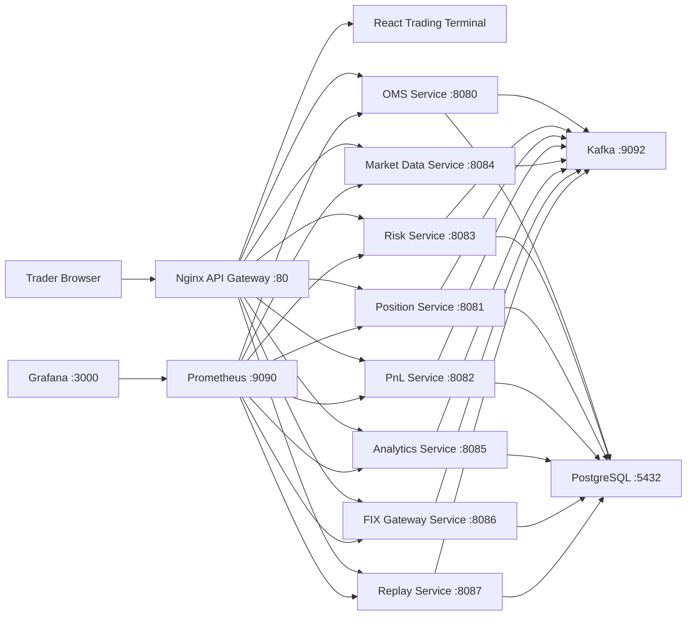

# MarketX Production Deployment

Phase 15 packages MarketX as a Docker Compose based distributed trading platform.

## Architecture



## Services

| Service | Internal Port | Public Access |
| --- | ---: | --- |
| Nginx | 80 | `http://localhost` |
| Trading Terminal | 80 | Through Nginx |
| OMS Service | 8080 | `http://localhost/api/orders` |
| Position Service | 8081 | `http://localhost/api/positions` |
| PnL Service | 8082 | `http://localhost/api/pnl` |
| Risk Service | 8083 | `http://localhost/api/risk` |
| Market Data Service | 8084 | `http://localhost/api/market-data` |
| Analytics Service | 8085 | `http://localhost/api/analytics` |
| FIX Gateway Service | 8086 | `http://localhost/api/fix` |
| Replay Service | 8087 | `http://localhost/api/replay` |
| Kafka | 9092 | `kafka:9092` inside Docker |
| PostgreSQL | 5432 | `localhost:5432` |
| Redis | 6379 | `localhost:6379` |
| Prometheus | 9090 | `http://localhost:9090` |
| Grafana | 3000 | `http://localhost:3000` |

## Databases

One PostgreSQL container runs all service databases. The init script at `docker/postgres/init.sql` creates:

- `marketx_oms`
- `marketx_positions`
- `marketx_pnl`
- `marketx_risk`
- `marketx_analytics`
- `marketx_fix`
- `marketx_replay`

## Environment

Copy `.env.example` to `.env` if you want to override defaults:

```bash
cp .env.example .env
```

Important variables:

```text
POSTGRES_USER=marketx
POSTGRES_PASSWORD=marketx
POSTGRES_DB=marketx
KAFKA_BOOTSTRAP_SERVERS=kafka:9092
REDIS_HOST=redis
REDIS_PORT=6379
SPRING_PROFILES_ACTIVE=docker
GRAFANA_ADMIN_USER=admin
GRAFANA_ADMIN_PASSWORD=marketx
```

Do not commit real secrets. Keep production credentials outside the repo.

## Build

```bash
docker compose build
```

## Run

```bash
docker compose up -d
```

Open:

```text
Trading Terminal: http://localhost
Grafana:          http://localhost:3000
Prometheus:       http://localhost:9090
OMS API:          http://localhost/api/orders
```

Grafana defaults to `admin / marketx` unless changed in `.env`.

## Logs

All services use Docker `json-file` logs with size rotation. Spring Boot console logs include `service=<name>` in the pattern.

```bash
docker compose logs -f oms-service
docker compose logs -f risk-service
docker compose logs -f nginx
```

The `docker/logs` directory is mounted for future file-based logging support.

## Stop

```bash
docker compose down
```

To remove persisted PostgreSQL, Kafka, Redis, Prometheus, and Grafana data:

```bash
docker compose down -v
```

## API Gateway Routes

| Route | Upstream |
| --- | --- |
| `/api/orders/` | `oms-service:8080` |
| `/api/order-book/` | `oms-service:8080` |
| `/api/trades/` | `oms-service:8080` |
| `/api/positions/` | `position-service:8081` |
| `/api/pnl/` | `pnl-service:8082` |
| `/api/risk/` | `risk-service:8083` |
| `/api/market-data/` | `market-data-service:8084` |
| `/api/analytics/` | `analytics-service:8085` |
| `/api/fix/` | `fix-gateway-service:8086` |
| `/api/replay/` | `replay-service:8087` |
| `/` | `trading-terminal:80` |

## End-to-End Docker Test

1. Start the full platform:

```bash
docker compose up -d
```

2. Open the terminal:

```text
http://localhost
```

3. Submit a BUY order.
4. Submit a SELL order at a matching price.
5. Check the order book, trades, positions, PnL, analytics, and Grafana metrics.

Useful checks:

```bash
docker compose ps
docker compose logs -f oms-service
curl http://localhost/api/orders
curl http://localhost/api/positions
curl http://localhost:9090/-/healthy
```

## CI/CD

`.github/workflows/ci.yml` runs on push and pull request:

- Installs `backend/common-events`
- Builds and tests all Maven services
- Builds the React terminal
- Builds Docker Compose images

`.github/workflows/docker-publish.yml` is optional and only runs when Docker Hub secrets exist:

- `DOCKERHUB_USERNAME`
- `DOCKERHUB_TOKEN`

It builds the local Compose images, tags them under the configured Docker Hub account, and pushes them.
