# Trade Flow Diagram

This diagram shows the simplified end-to-end path of a trade through an institutional trading technology system.

```mermaid
flowchart LR
    Trader["Trader"]
    OMS["Order Management System (OMS)"]
    Risk["Risk Engine"]
    Exchange["Exchange"]
    Matching["Matching Engine"]
    Execution["Execution Report"]
    Position["Position Service"]
    PnL["PnL Service"]
    Settlement["Settlement / Clearing"]

    Trader --> OMS
    OMS --> Risk
    Risk --> Exchange
    Exchange --> Matching
    Matching --> Execution
    Execution --> Position
    Position --> PnL
    PnL --> Settlement
```

## Flow Summary

| Step | System | Responsibility |
| ---: | --- | --- |
| 1 | Trader | Creates a buy or sell order. |
| 2 | OMS | Records and tracks the order. |
| 3 | Risk Engine | Checks whether the order is allowed. |
| 4 | Exchange | Receives the order for trading. |
| 5 | Matching Engine | Matches compatible buy and sell orders. |
| 6 | Execution Report | Sends trade results back to internal systems. |
| 7 | Position Service | Updates holdings after the trade. |
| 8 | PnL Service | Updates profit and loss. |
| 9 | Settlement / Clearing | Finalizes cash and asset transfer. |
