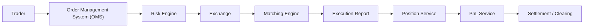

# How a Trade Happens

This document explains how a trade moves through a financial markets technology system from the moment a trader places an order to the point where the trade is reflected in positions, PnL, and settlement.

The simplified flow is:



## Simple Explanation

A trade happens when a buyer and seller agree on a price for a financial instrument, such as a stock.

In modern markets, this usually happens electronically:

1. A trader sends an order.
2. The order passes through internal systems.
3. Risk checks decide whether the order is allowed.
4. The order is sent to an exchange.
5. The exchange matching engine compares buy and sell orders.
6. If prices are compatible, a trade executes.
7. Execution details flow back to the broker or bank.
8. Internal systems update positions and PnL.
9. Settlement and clearing make sure ownership and cash are transferred correctly.

## Core Concepts

| Term | Simple Meaning |
| --- | --- |
| Stock | A small ownership share in a company. |
| Exchange | A marketplace where buyers and sellers trade financial instruments. |
| Broker | A firm that connects traders or clients to markets. |
| Trader | A person or system that decides to buy or sell. |
| Bid | The highest price buyers are currently willing to pay. |
| Ask | The lowest price sellers are currently willing to accept. |
| Spread | The difference between the best ask and best bid. |
| Order Book | A live list of buy and sell orders waiting to trade. |
| Market Order | An order to trade immediately at the best available price. |
| Limit Order | An order to trade only at a specified price or better. |

## Step-by-Step Trade Lifecycle

### 1. Trader Creates an Order

A trader decides to buy or sell a stock.

Example:

| Field | Value |
| --- | --- |
| Side | BUY |
| Symbol | AAPL |
| Quantity | 100 shares |
| Order Type | Limit Order |
| Limit Price | 190.00 |

This means: buy 100 shares of AAPL, but do not pay more than 190.00 per share.

What can go wrong:

- The trader enters the wrong symbol.
- The quantity is too large.
- The price has a typo.
- The trader submits the order twice by mistake.

### 2. OMS Receives the Order

The Order Management System, or OMS, tracks the order from creation to completion.

The OMS usually:

- Assigns an internal order ID.
- Stores the order state.
- Validates required fields.
- Routes the order to risk checks.
- Tracks whether the order is new, rejected, partially filled, filled, or canceled.

What can go wrong:

- Required fields are missing.
- Duplicate order IDs are created.
- The OMS loses track of the latest order state.
- A cancellation arrives while the original order is already being executed.

### 3. Risk Engine Checks the Order

The risk engine decides whether the order is allowed before it reaches the market.

Common risk checks include:

| Check | Why It Matters |
| --- | --- |
| Buying power | Confirms the account has enough money or credit. |
| Position limit | Prevents the trader from owning too much of one instrument. |
| Order size limit | Blocks unusually large orders. |
| Price reasonability | Rejects prices that are far away from the current market. |
| Restricted symbols | Stops trading in instruments that are blocked. |

What can go wrong:

- Risk rules are stale or misconfigured.
- A valid order is rejected incorrectly.
- A bad order passes risk checks.
- Risk checks are too slow and delay trading.

### 4. Order Goes to the Exchange

If the order passes risk checks, it is sent to an exchange.

An exchange is a marketplace where orders from many participants meet. The broker or bank usually connects to the exchange through a protocol such as FIX.

What can go wrong:

- Network connectivity fails.
- The exchange rejects the order.
- The order arrives too late because market prices changed.
- The bank and exchange disagree about the current order state.

### 5. Matching Engine Tries to Match Orders

The matching engine is the core system inside an exchange. It compares buy orders and sell orders in the order book.

A buy order can match when its price is greater than or equal to the best available sell price.

A sell order can match when its price is less than or equal to the best available buy price.

## Example: BUY Limit Order

Current order book for AAPL:

| Bids: Buyers | Quantity |
| --- | ---: |
| 189.95 | 200 |
| 189.90 | 500 |

| Asks: Sellers | Quantity |
| --- | ---: |
| 190.05 | 100 |
| 190.10 | 300 |

The best bid is 189.95. The best ask is 190.05. The spread is:

```text
190.05 - 189.95 = 0.10
```

Now a trader sends:

```text
BUY 100 AAPL LIMIT 190.00
```

This order does not execute immediately because the lowest seller is asking 190.05, and the buyer is only willing to pay 190.00.

The buy order rests in the order book:

| Bids: Buyers | Quantity |
| --- | ---: |
| 190.00 | 100 |
| 189.95 | 200 |
| 189.90 | 500 |

| Asks: Sellers | Quantity |
| --- | ---: |
| 190.05 | 100 |
| 190.10 | 300 |

## Example: SELL Order Matching It

Later, another trader sends:

```text
SELL 100 AAPL LIMIT 190.00
```

This sell order can match because the best buyer is willing to pay 190.00, and the seller is willing to sell at 190.00.

Result:

| Field | Value |
| --- | --- |
| Symbol | AAPL |
| Quantity Executed | 100 shares |
| Execution Price | 190.00 |
| Buyer | Original BUY limit order |
| Seller | New SELL limit order |

The trade has now executed.

What can go wrong:

- The matching engine applies price-time priority incorrectly.
- The same order is matched twice.
- A partial fill is reported as a full fill.
- Market data and execution reports disagree.

### 6. Execution Report Is Sent Back

An execution report tells the broker or bank what happened to the order.

It may say:

| Status | Meaning |
| --- | --- |
| New | The exchange accepted the order. |
| Rejected | The exchange rejected the order. |
| Partially Filled | Some quantity traded, but some remains open. |
| Filled | The full quantity traded. |
| Canceled | The remaining quantity was canceled. |

For the example trade:

| Field | Value |
| --- | --- |
| Order ID | Internal or exchange order ID |
| Execution ID | Unique ID for this execution |
| Symbol | AAPL |
| Side | BUY |
| Last Quantity | 100 |
| Last Price | 190.00 |
| Order Status | Filled |

What can go wrong:

- Execution reports arrive out of order.
- Duplicate reports are received.
- A report is missing.
- Internal systems process the same execution twice.

### 7. Position Service Updates Holdings

The position service tracks what the account owns.

If the trader bought 100 shares of AAPL, the position increases by 100 shares.

Example:

| Before Trade | Trade | After Trade |
| ---: | ---: | ---: |
| 50 AAPL | Buy 100 AAPL | 150 AAPL |

What can go wrong:

- Positions are updated with duplicate executions.
- Partial fills are handled incorrectly.
- Buy and sell signs are reversed.
- Position updates are delayed.

### 8. PnL Service Updates Profit and Loss

PnL means profit and loss. The PnL service estimates how much money a trader, desk, or account has made or lost.

There are two common types:

| Type | Meaning |
| --- | --- |
| Realized PnL | Profit or loss from trades that have been closed. |
| Unrealized PnL | Estimated profit or loss on open positions using current market prices. |

What can go wrong:

- Market prices are stale.
- Trade prices are incorrect.
- Fees or commissions are missing.
- Currency conversion is wrong.

### 9. Settlement and Clearing

Execution is not the final legal completion of a trade. Settlement and clearing happen after execution.

Clearing confirms the trade details and manages obligations between buyer and seller. Settlement is the process where cash and ownership are actually exchanged.

For a stock trade, this means:

- The buyer receives the shares.
- The seller receives the cash.
- Clearing systems reduce counterparty risk.
- Records are finalized across brokers, custodians, and clearing houses.

What can go wrong:

- Trade details do not match between parties.
- One side cannot deliver shares or cash.
- Settlement instructions are incorrect.
- Regulatory reporting is incomplete.

## What Each System Does

| System | Main Responsibility |
| --- | --- |
| Trader | Decides what to buy or sell. |
| OMS | Tracks orders and their lifecycle. |
| Risk Engine | Blocks orders that violate rules. |
| Exchange | Marketplace where orders are received. |
| Matching Engine | Matches compatible buy and sell orders. |
| Execution Report | Communicates what happened to an order. |
| Position Service | Updates holdings after executions. |
| PnL Service | Calculates profit and loss. |
| Settlement / Clearing | Finalizes obligations, cash, and ownership transfer. |

## Why Banks Care About Latency, Reliability, and Correctness

Institutional trading systems handle large amounts of money. Small technology problems can become expensive very quickly.

| Quality | Why It Matters |
| --- | --- |
| Latency | Prices move quickly. A slow order may miss the market or execute at a worse price. |
| Reliability | Trading systems must stay available during market hours. Downtime can block clients from trading. |
| Correctness | Wrong positions, duplicate trades, or bad risk checks can create financial and regulatory problems. |

Correctness is especially important because every system depends on the previous one. If an execution report is processed incorrectly, positions may be wrong. If positions are wrong, PnL may be wrong. If PnL is wrong, traders and risk managers may make bad decisions.

MarketX will use this trade lifecycle as the foundation for future implementation phases.
