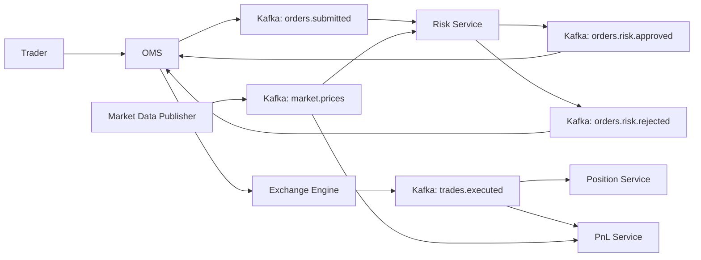

# Phase 8 - Kafka Event Bus

Phase 8 moves MarketX from mostly synchronous REST calls toward event-driven communication with Kafka.

REST APIs still exist for manual testing, but the core order flow now uses events:



## Kafka Concepts

| Concept | Meaning In MarketX |
| --- | --- |
| Producer | A service that publishes events, such as OMS publishing `OrderSubmittedEvent`. |
| Consumer | A service that reads events, such as Risk Service consuming `orders.submitted`. |
| Topic | A named event stream, such as `trades.executed`. |
| Partition | An ordered slice of a topic. This phase uses one partition per topic for simplicity. |
| Offset | Kafka's position marker for each consumed message. |
| Consumer group | A named group of consumers that share work. Each MarketX service has its own group. |

## Why Event-Driven Architecture Helps Trading Systems

Trading platforms have many services that care about the same event. When a trade executes, OMS, Position, PnL, surveillance, reporting, and clearing may all need to react.

Kafka lets the exchange publish one `TradeExecutedEvent` and allows each downstream service to consume it independently. This reduces tight coupling and avoids making OMS synchronously call every service.

## Topics

| Topic | Produced By | Consumed By |
| --- | --- | --- |
| `orders.submitted` | OMS | Risk Service |
| `orders.risk.approved` | Risk Service | OMS |
| `orders.risk.rejected` | Risk Service | OMS |
| `trades.executed` | OMS embedded exchange adapter | OMS, Position Service, PnL Service |
| `market.prices` | PnL market price publisher | Risk Service, PnL Service |

Future dead-letter topics may include:

```text
orders.submitted.dlq
trades.executed.dlq
```

## Event Contracts

Shared event records live in:

```text
backend/common-events
```

Events:

| Event | Purpose |
| --- | --- |
| `OrderSubmittedEvent` | OMS asks Risk Service to evaluate a new order. |
| `OrderRiskApprovedEvent` | Risk Service approves the order. |
| `OrderRiskRejectedEvent` | Risk Service rejects the order with reasons. |
| `TradeExecutedEvent` | Exchange reports an executed trade. |
| `MarketPriceEvent` | Latest market price update for Risk and PnL. |

Every event includes:

- `eventId` for idempotency
- business key such as `orderId`, `tradeId`, or `symbol`
- timestamp

## Consumer Groups

| Service | Consumer Group |
| --- | --- |
| OMS | `oms-service-group` |
| Risk Service | `risk-service-group` |
| Position Service | `position-service-group` |
| PnL Service | `pnl-service-group` |

Each consumer stores processed `eventId` values in a `processed_events` table and skips duplicates safely.

## Start Kafka

From the repository root:

```bash
docker compose up -d
```

This starts:

- PostgreSQL on `localhost:5432`
- Kafka on `localhost:9092`

The compose file creates these topics:

```text
orders.submitted
orders.risk.approved
orders.risk.rejected
trades.executed
market.prices
```

## Run Services

Install the shared events module first:

```bash
cd backend/common-events
mvn install
```

Then run each service in its own terminal:

```bash
cd backend/oms-service
mvn spring-boot:run
```

```bash
cd backend/risk-service
mvn spring-boot:run
```

```bash
cd backend/position-service
mvn spring-boot:run
```

```bash
cd backend/pnl-service
mvn spring-boot:run
```

## End-To-End Test

Set limits:

```bash
curl -X PUT http://localhost:8083/risk/limits/TRADER-1 \
  -H "Content-Type: application/json" \
  -d '{
    "maxOrderQuantity": 10000,
    "maxPositionQuantity": 50000,
    "maxExposure": 1000000,
    "maxDailyLoss": 50000
  }'
```

Submit a BUY order:

```bash
curl -X POST http://localhost:8080/orders \
  -H "Content-Type: application/json" \
  -d '{
    "accountId": "TRADER-1",
    "symbol": "AAPL",
    "side": "BUY",
    "type": "LIMIT",
    "quantity": 100,
    "price": 150.0
  }'
```

Expected immediate response:

```json
{
  "orderId": "ORD-1",
  "status": "PENDING_RISK",
  "message": "Order submitted for risk evaluation"
}
```

Submit a SELL order from another account:

```bash
curl -X POST http://localhost:8080/orders \
  -H "Content-Type: application/json" \
  -d '{
    "accountId": "TRADER-2",
    "symbol": "AAPL",
    "side": "SELL",
    "type": "LIMIT",
    "quantity": 100,
    "price": 150.0
  }'
```

Check order:

```bash
curl http://localhost:8080/orders/ORD-1
```

Check positions:

```bash
curl http://localhost:8081/positions/TRADER-1/AAPL
```

Check PnL:

```bash
curl http://localhost:8082/pnl/TRADER-1/AAPL
```

Publish market price:

```bash
curl -X POST http://localhost:8082/market-prices/publish \
  -H "Content-Type: application/json" \
  -d '{
    "symbol": "AAPL",
    "price": 155.0,
    "timestamp": "2026-06-09T10:00:00"
  }'
```
